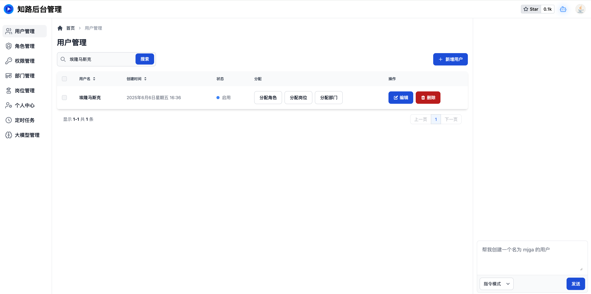
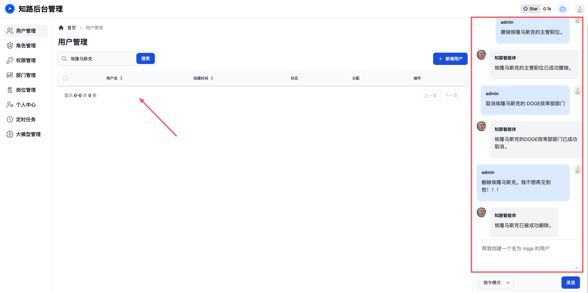

# 🔥 知路后台管理 - 通过 AI 驱动的前后端脚手架

[项目演示地址（请大家爱护公共数据喔）](https://admin.mjga.cc)

知路是一个**自带 AI 助手并通过 AI 驱动业务的** `Vue3.5 Java21` 前后端脚手架。

本项目特点简略说明如下（下面有详细说明）

- 国内首个原生集成 AI，并通过 AI 驱动的后台管理
- 原生集成 Docker
- 只需一台装了操作系统的电脑即可部署（不装 java，不装 js，不装数据库）
- 高质量的代码
- 正确的业务建模

**❤️ 本项目急需各位佬友、掘友、B友、C友、各种友们的 Star 火力支持！！！十分感谢 🙇**

- [🔥 知路后台管理 - 通过 AI 驱动的前后端脚手架](#-知路后台管理---通过-ai-驱动的前后端脚手架)
  - [🥝 产品社群](#-产品社群)
  - [🍅 相关课程](#-相关课程)
  - [🧠 原生 AI 驱动](#-原生-ai-驱动)
  - [🍹 尊重设计与编码规范](#-尊重设计与编码规范)
  - [🍓 正确的业务建模](#-正确的业务建模)
  - [🍟 专属业务功能](#-专属业务功能)
  - [🍄‍🟫 云原生开发与零配置部署](#-云原生开发与零配置部署)
  - [🌶️ 自动免费的 HTTPS 证书](#️-自动免费的-https-证书)
  - [❗国服特色](#国服特色)
  - [🥒 自动化数据库管理](#-自动化数据库管理)
  - [🍑 更多](#-更多)
  - [🍒 部分技术选型](#-部分技术选型)
  - [🔮 防失联，关注各大社区账号](#-防失联关注各大社区账号)
  - [💌 微信打赏](#-微信打赏)

## 🥝 产品社群

**加 QQ 群，获取一键部署脚本（包含数据库 Redis 消息队列等所有中间件！）**

- QQ群：638254979 (获取部署脚本)
  

没有 QQ 的可以加微信我拉你进群

- 微信：Chuck9996
  
或者直接扫码（若已过期可以加我 vx）

## 🍅 相关课程

已上线：

- [《重构方法论与单元测试的艺术》](https://www.bilibili.com/cheese/play/ep1615343)

敬请期待：（加群获取）

- [《知路脚手架喂饭级教程》]()
- [《领域驱动没那么复杂-贫民项目的领域架构实战》]()

## 🧠 原生 AI 驱动

知路管理后台自带了免费的知路智能体供开发者使用。该智能体目前支持两种对话模式：

- 企业问答
- 操作业务功能（指令模式）

并支持对接两种国产大模型：

- DeepSeek
- 智谱清言
- 更多大模型正在接入中

用户通过和知路智能体对话，便可完成所有核心业务操作，不再需要再去学习操作复杂的前端页面。使你在任何时间都可享受运筹帷幄，指点江山的人生乐趣！

**更多功能正在锐意制作中，敬请期待。。。**

## 🍹 尊重设计与编码规范

本系统在开发过程中以《TDD测试驱动开发》为指导思想，在业务代码中贯彻落实了严格、规范、优良的编码与设计；并编写了大量的单元测试、集成测试、切片测试为你的应用保驾护航。

本系统的测试代码全网独一无二，内容无可挑剔；其中包含大量编码设计的哲学理念。

具体内容请参考 [测试目录](/backend/src/test/java/com/zl/mjga)，并辅以视频教程[《重构方法论与单元测试的艺术》](https://www.bilibili.com/cheese/play/ep1615343)进行阅读，它将会使你受益匪浅。

吃透这款脚手架与配套课程，从今以后就不是别人 Review 你的代码，而是你对别人的代码进行指摘。

## 🍓 正确的业务建模

很多产品为了规避复杂的业务逻辑，会强行把某些多对多关系的业务设计为一对多以规避复杂的技术实现；但这样的设计不仅没有解决问题，反而增加了问题。

本系统从一开始就致力于正确的业务建模。当面对复杂的产品逻辑时，我们不采取鸵鸟战术，而是采取以下两个手段直面困难：

- 在框架层面进行抽象与封装
- 使用现代化的技术选型从根本上解决

使用本系统构建的系统，只需要几行代码即可轻松编写之前难以实现的复杂业务逻辑，让开发者倍感轻松。

## 🍟 专属业务功能

得益于上述设计思想，在本系统中用户不仅可以担任多个岗位，还能够隶属于多个部门，同时还可拥有多个部门的数据权限。

另外，岗位和部门还可以相互配合，提供更加复杂的产品逻辑的实现支持。

今后还将推出更多复杂业务逻辑的解决方案，敬请期待。

## 🍄‍🟫 云原生开发与零配置部署

知路管理后台是完全围绕云原生进行设计开发的。这意味着你只需要三个步骤就可以部署完整个前后端系统：

1. 拥有一台安装了操作系统的电脑
2. 安装 Docker
3. 下载代码，一键运行部署脚本

你不需要安装 Java，不需要安装 Javascript，不需要安装 Vue，不需要安装 mysql，不需要配置这个，修改那个。

无论你是 Linux 还是 Mac 还是 Windows，都能够在 2 秒钟内一键部署好整个系统。

**获取部署脚本，请加 QQ 群：638254979**

## 🌶️ 自动免费的 HTTPS 证书

本系统会在「开发环境->测试环境->生产环境」自动生成并配置免费的 Https 证书供你使用。不需要任何配置，只要运行部署脚本即可马上获取这项功能。

如果你是一个有经验的开发者，尤其是前端开发者，就应该能明白在开发和测试环境使用 Https 调试是多么的重要。

>注意，开发环境和测试环境的证书是自签名的，这意味着访问网站时需要手动点击信任按钮

## ❗国服特色

本项目已将以下仓库自动替换为国内镜像仓库，省却了用户自行配置的烦恼

- npm 官方仓库 -> 腾讯云镜像仓库
- maven 官方仓库 -> 腾讯云镜像仓库
- gradle-wrapper 官方仓库 -> 腾讯云镜像仓库
- docker 官方仓库 -> 无法自动替换，需在本机指定 daemon.json 文件。
  
## 🥒 自动化数据库管理

本系统会自动管理将所有数据库功能，包括自动建表、自动修改、删除字段、自动增加索引等；

不仅如此，脚手架还会在代码库中对你的修改历史进行版本管理。从而方便你对任意时间点的数据库修改进行回朔。

总而言之，你唯一需要做的就是业务编码，然后把其他复杂的事情交给脚手架。

## 🍑 更多

- 开发、测试、生产全生态链云原生环境
- 通过 .env 管理开发、测试、生产环境所有账号密码。
- 在框架层面集成的代码格式化与规范检查
- 自动生成数据库建模、DAO、单表 CRUD
- 其他更多功能

## 🍒 部分技术选型

**前端**

| 框架 | 版本  |
|---|---|
| node  | lts/jod |
| vue-family  | ^3.5 |
| vite-family  | ^6.2.1 |
| tailwindcss | ^4.0 |
| zod | ^3.2 |
| pinia |^3.0 |
| biome |^1.9.4 |
| playwright |^1.51.1 |
| msw |^1.51.1 |
| openapi-typescript | ^7.6.1 |
| typescript | ~5.8.0 |
| docker  | ^27  |

**后端**

| 技术 | 版本  |
|---|---|
| java  | 21  |
| spring-boot  | 3.3.9  |
| spring-security  | 3.3.9  |
| spring-cache  | 3.3.9 |
| spring-doc  | 2.6.0  |
| test-containers  | 1.20.6  |
| jooq  | 3.19.18  |
| postgresql  | 17.3  |
| flyway  | 11.4  |
| spotless  | 7.0.2  |
| pmd  | 7.9.0  |
| gradle  | 8.13  |
| docker  | ^27  |

## 🔮 防失联，关注各大社区账号

## 💌 微信打赏

知路管理后台的发展离不开您的支持；再次对所有支持本项目的人们致以诚挚的谢意～

