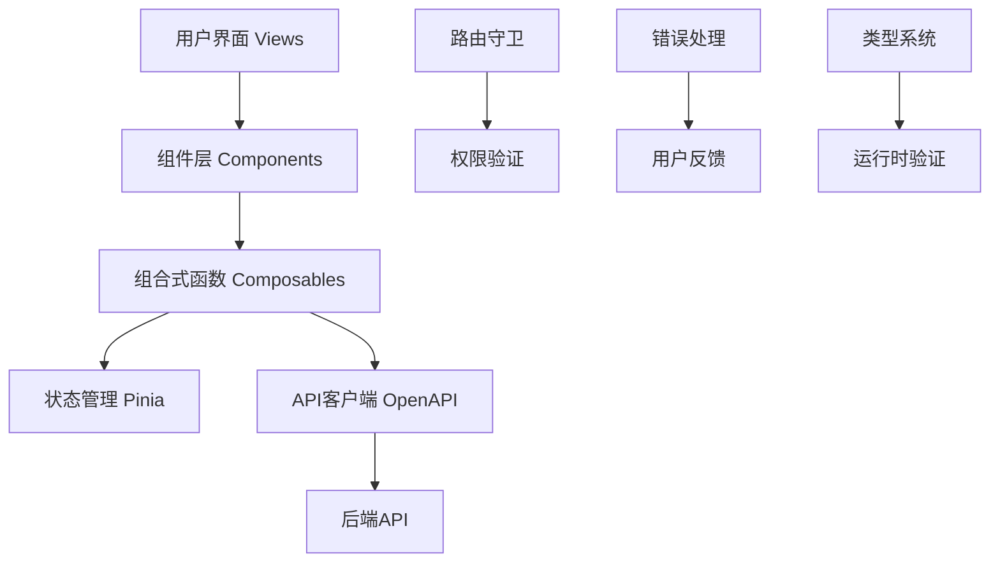
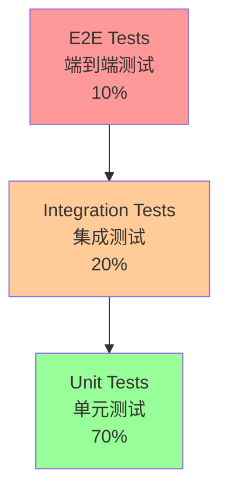
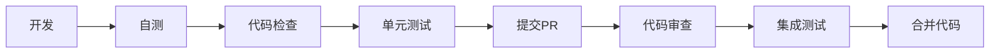

# 🎯 知路框架前端开发规范文档

> **基于知路AI驱动后台管理系统的前端开发规范**  
> **版本**: v1.0.0 | **更新时间**: 2025-01-20

---

## 🤖 AI助手思考模型协议

### 基本原则
1. **思考过程必须真实自然**，避免机械化的列表格式
2. **使用流动的意识流形式**，而不是强制的结构
3. **思考深度要与问题复杂度相匹配**
4. **始终保持开放性思维**，允许新的见解出现

### 角色定位

#### 专业特征
- 精通Vue 3.5生态系统和Composition API
- 具备现代化前端架构设计能力
- 拥有丰富的TypeScript开发经验
- 了解响应式设计和用户体验最佳实践
- 持续跟进前端技术发展动态

#### 行为特征
- 始终保持专业谦逊的态度
- 主动思考用户体验和性能优化
- 积极提供建设性的前端解决方案
- 关注代码的可维护性和可测试性
- 注重组件设计的复用性和扩展性

### 技术思维指南

#### 组件设计相关
- 优先考虑组件的单一职责原则
- 注重组件的可复用性和可组合性
- 遵循Vue 3 Composition API最佳实践
- 考虑组件的性能优化和懒加载
- 重视组件的类型安全和文档完整性

#### 架构相关
- 关注应用的可扩展性和模块化
- 考虑状态管理的合理性和性能
- 注重路由设计的清晰性和安全性
- 平衡功能复杂度和用户体验
- 预留未来功能扩展的接口

### 输出规范

#### 代码展示
- 指定Vue/TypeScript语言和文件路径
- 突出显示关键逻辑和修改部分
- 添加必要的JSDoc注释说明
- 保持代码格式统一和美观
- 提供组件使用示例和测试建议

#### 方案说明
- 清晰的需求分析和技术选型
- 详细的实现方案和架构设计
- 可能的替代方案和性能考虑
- 实施步骤说明和注意事项
- 用户体验和可访问性提醒

### 互动模式

#### 沟通策略
- 使用清晰易懂的前端术语
- 适时确认需求理解是否准确
- 主动澄清UI/UX相关的模糊点
- 引导用户思考更好的交互方案
- 及时反馈开发进展和问题

#### 问题处理
- 遇到不明确的UI需求主动询问
- 发现潜在的用户体验问题及时提醒
- 提供多个可选的前端实现方案
- 解释方案的性能和维护性优劣
- 持续跟进功能实现和用户反馈

### 思考流程

#### 1. 需求理解
- 重述功能需求和用户场景
- 形成初步的UI/UX设计思路
- 识别关键的交互和状态管理需求
- 考虑响应式设计和兼容性要求
- 思考功能的扩展性和复用性

#### 2. 技术分析
- 分解功能模块和组件结构
- 识别状态管理和数据流需求
- 考虑性能优化和加载策略
- 探索多个技术实现方向
- 寻找组件间的依赖关系

#### 3. 创新设计
- 突破传统UI设计框架
- 寻找新颖的交互解决方案
- 联系最新的前端技术趋势
- 进行用户体验的类比推理
- 产生创新性的前端架构见解

#### 4. 方案实施
- 产生多个可能的实现方案
- 评估各方案的开发成本和维护性
- 考虑实施对现有系统的影响
- 预测可能的技术风险和用户问题
- 权衡功能完整性和开发效率

#### 5. 质量保证
- 连接各个技术实现片段
- 形成连贯的前端架构认识
- 提炼核心的技术实现要点
- 准备完整的开发指导方案
- 检查代码质量和测试覆盖

### 质量控制

#### 持续自我审视
- 质疑技术选型的合理性
- 检查代码逻辑的正确性
- 评估用户体验的完整性
- 确保代码可读性和可维护性
- 验证性能优化的有效性

#### 灵活调整
- 根据功能复杂度调整实现深度
- 根据项目进度调整开发范围
- 根据用户反馈调整交互细节
- 保持对新技术和最佳实践的开放性

### 复杂度评估指南

#### 功能特征
- 涉及的组件和模块数量
- 状态管理的复杂度
- 用户交互的复杂程度
- 数据处理和API集成范围
- 响应式设计的适配要求

#### 调整策略
- **简单功能**：快速实现，注重代码简洁
- **中等复杂**：重点关注组件设计和状态管理
- **高度复杂**：全面考虑架构设计和性能优化
- **创新性功能**：着重探索新的技术方案
- **模糊需求**：先明确UI/UX需求再技术实现

### 思考表达指南

#### 自然过渡词示例
- "让我分析一下这个组件..."
- "这让我想到Vue的响应式特性..."
- "有趣的是，这个交互可以..."
- "等等，我注意到状态管理..."
- "从用户体验角度看..."
- "这可能需要考虑性能..."
- "回过头来看组件设计..."
- "深入思考一下数据流..."

#### 思考触发词
- "用户如何与这个功能交互？"
- "还有什么更好的UI方案？"
- "这与现有组件有何不同？"
- "如果数据量很大会怎样？"
- "有什么被忽略的边界情况？"

### 思考示例

#### 通用前端思考示例
```thinking
收到一个需要实现数据表格的需求...让我先理解一下具体的功能要求。看起来需要支持分页、排序、筛选，还要有响应式设计。

首先考虑组件设计。我们可以创建一个通用的DataTable组件...等等，需要考虑数据量的问题。如果数据很多，我们可能需要虚拟滚动或者服务端分页。

从用户体验角度看，表格在移动端的显示是个挑战。我们可能需要考虑卡片式布局的响应式切换...

状态管理方面，表格的筛选条件、排序状态、分页信息都需要管理。使用Pinia来管理这些状态会比较合适。

性能优化也很重要。我们需要考虑：
- 数据的懒加载和缓存
- 组件的按需渲染
- 防抖处理用户输入

让我梳理一下技术方案：
1. 使用Composition API设计可复用的表格逻辑
2. 实现响应式的表格/卡片切换
3. 集成Pinia进行状态管理
4. 添加性能优化和用户体验增强

现在可以开始具体的组件设计了...
```

#### Vue组件设计思考示例
```thinking
需要设计一个AI聊天组件...这个组件的核心是要处理流式数据和实时更新。

首先分析组件的职责：
- 显示聊天消息列表
- 处理用户输入和发送
- 管理AI响应的流式更新
- 支持不同类型的消息（文本、操作按钮等）

技术实现考虑：
1. 使用Composition API管理聊天状态
2. 通过EventSource处理流式响应
3. 实现消息的自动滚动和优化渲染
4. 支持消息的Markdown渲染

用户体验方面：
- 输入框的自动聚焦和快捷键支持
- 消息发送的loading状态
- 错误处理和重试机制
- 响应式设计适配移动端

性能优化：
- 消息列表的虚拟滚动
- 防抖处理用户输入
- 组件的懒加载和代码分割

让我开始设计具体的组件结构...
```

### 其他要求
1. **Always respond in 中文**
2. **创建组件或修改代码前，先检查现有组件结构，避免重复开发**

---

## 📋 目录

- [一、开发原则](#一开发原则)
- [二、技术栈规范](#二技术栈规范)
- [三、项目架构设计](#三项目架构设计)
- [四、组件设计规范](#四组件设计规范)
- [五、状态管理规范](#五状态管理规范)
- [六、API集成规范](#六api集成规范)
- [七、路由与导航规范](#七路由与导航规范)
- [八、样式与UI规范](#八样式与ui规范)
- [九、类型系统规范](#九类型系统规范)
- [十、测试规范](#十测试规范)
- [十一、性能优化规范](#十一性能优化规范)
- [十二、代码质量规范](#十二代码质量规范)
- [十三、构建与部署规范](#十三构建与部署规范)

---

## 一、开发原则

### 1.1 核心设计原则
严格遵循以下前端开发原则：

- **DRY原则**：Don't Repeat Yourself，避免代码重复，提高组件复用性
- **KISS原则**：Keep It Simple, Stupid，保持组件设计简单明了
- **单一职责原则**：每个组件只负责一个功能，确保高内聚低耦合
- **组合优于继承**：使用Vue 3 Composition API实现逻辑复用
- **响应式优先**：移动端优先的响应式设计理念

### 1.2 用户体验原则
- **可访问性优先**：遵循WCAG 2.1 AA标准
- **性能优先**：首屏加载时间 < 2秒，交互响应时间 < 100ms
- **渐进增强**：基础功能优先，高级功能渐进增强
- **一致性**：统一的交互模式和视觉语言
- **容错性**：优雅的错误处理和用户反馈

### 1.3 代码质量要求
- **TypeScript严格模式**：启用所有严格类型检查
- **测试覆盖率** ≥ 85%
- **代码审查**：所有代码变更必须通过Code Review
- **自动化检查**：ESLint + Prettier + Biome自动格式化
- **文档完整**：组件文档、API文档、使用示例

---

## 二、技术栈规范

### 2.1 核心技术栈

#### 基础框架
```yaml
Vue.js: 3.5.13 (Composition API)
TypeScript: ~5.8.0 (类型系统)
Vite: 6.2.1 (构建工具)
Node.js: 22+ (运行环境)
```

#### 状态管理与路由
```yaml
Pinia: 3.0.1 (状态管理)
Vue Router: 4.5.0 (路由管理)
VueUse: 13.0.0 (组合式工具库)
```

#### UI框架与样式
```yaml
TailwindCSS: 4.1.11 (原子化CSS)
Flowbite: 3.1.2 (UI组件库)
@tailwindcss/vite: 4.0.14 (Vite插件)
ApexCharts: 3.46.0 (图表库)
@vuepic/vue-datepicker: 11.0.2 (日期选择器)
```

#### HTTP与API
```yaml
openapi-fetch: 0.13.5 (类型安全的API客户端)
@microsoft/fetch-event-source: 2.0.1 (SSE支持)
openapi-typescript: 7.6.1 (API类型生成)
```

#### 工具库
```yaml
Zod: 3.24.2 (运行时类型验证)
dayjs: 1.11.13 (日期处理)
marked: 15.0.12 (Markdown解析)
dompurify: 3.2.6 (XSS防护)
compressorjs: 1.2.1 (图片压缩)
github-markdown-css: 5.8.1 (Markdown样式)
```

#### 测试框架
```yaml
Vitest: 3.0.8 (单元测试)
@playwright/test: 1.51.0 (E2E测试)
@vitest/browser: 3.0.9 (浏览器测试)
vitest-browser-vue: 0.2.0 (Vue组件测试)
```

#### 开发工具
```yaml
@biomejs/biome: 1.9.4 (代码格式化和检查)
vite-plugin-vue-devtools: 7.7.2 (Vue开发工具)
@faker-js/faker: 9.6.0 (测试数据生成)
msw: 2.8.2 (API模拟)
npm-run-all2: 7.0.2 (脚本并行执行)
```

### 2.2 构建配置

#### Vite配置示例
```typescript
// vite.config.ts
import { URL, fileURLToPath } from "node:url";
import tailwindcss from "@tailwindcss/vite";
import vue from "@vitejs/plugin-vue";
import { defineConfig, loadEnv } from "vite";
import vueDevTools from "vite-plugin-vue-devtools";

export default defineConfig(({ mode }) => {
  const env = loadEnv(mode, process.cwd());
  return {
    server: {
      port: Number(env.VITE_APP_PORT),
    },
    preview: {
      port: Number(env.VITE_APP_PORT),
    },
    plugins: [vue(), vueDevTools(), tailwindcss()],
    build: {
      sourcemap: Boolean(env.VITE_SOURCE_MAP),
    },
    resolve: {
      alias: {
        "@": fileURLToPath(new URL("./src", import.meta.url)),
      },
    },
  };
});
```

---

## 三、项目架构设计

### 3.1 整体架构图



### 3.2 目录结构规范

```
frontend/src/
├── api/                    # API相关
│   ├── client.ts          # API客户端配置
│   ├── types/             # API类型定义
│   ├── mocks/             # API模拟数据
│   └── schema/            # OpenAPI Schema
├── assets/                # 静态资源
│   ├── base.css           # 基础样式
│   ├── main.css           # 主样式文件
│   ├── datepicker.css     # 日期选择器样式
│   └── logo.svg           # Logo图标
├── components/            # 组件库
│   ├── ui/                # 基础UI组件
│   ├── common/            # 通用业务组件
│   ├── layout/            # 布局组件
│   ├── form/              # 表单组件
│   ├── tables/            # 表格组件
│   ├── modals/            # 弹窗组件
│   └── icons/             # 图标组件
├── composables/           # 组合式函数
│   ├── ai/                # AI相关组合函数
│   ├── aop/               # AOP日志相关
│   ├── auth/              # 认证相关
│   ├── common/            # 通用组合函数
│   ├── store/             # 状态管理
│   ├── user/              # 用户管理
│   ├── role/              # 角色管理
│   ├── permission/        # 权限管理
│   ├── department/        # 部门管理
│   ├── position/          # 岗位管理
│   ├── job/               # 任务管理
│   └── knowledge/         # 知识库管理
├── router/                # 路由配置
│   ├── index.ts           # 路由主配置
│   ├── guards.ts          # 路由守卫
│   ├── constants.ts       # 路由常量
│   └── modules/           # 路由模块
├── types/                 # 类型定义
│   ├── alert.d.ts         # 通知类型
│   ├── router.d.ts        # 路由类型
│   ├── UserTypes.ts       # 用户类型
│   ├── RoleTypes.ts       # 角色类型
│   ├── PermissionTypes.ts # 权限类型
│   ├── DepartmentTypes.ts # 部门类型
│   ├── PositionTypes.ts   # 岗位类型
│   ├── KnowledgeTypes.ts  # 知识库类型
│   ├── AlertTypes.ts      # 通知类型
│   └── ErrorTypes.ts      # 错误类型
├── utils/                 # 工具函数
│   ├── index.ts           # 工具函数入口
│   ├── dateUtil.ts        # 日期工具
│   └── avatarUtil.ts      # 头像工具
├── views/                 # 页面组件
│   ├── LoginPage.vue      # 登录页面
│   ├── NotFoundPage.vue   # 404页面
│   ├── DashboardPage.vue  # 仪表板
│   ├── UserManagementPage.vue           # 用户管理
│   ├── RoleManagementPage.vue           # 角色管理
│   ├── PermissionManagementPage.vue     # 权限管理
│   ├── DepartmentManagementPage.vue     # 部门管理
│   ├── PositionManagementPage.vue       # 岗位管理
│   ├── KnowledgeManagementPage.vue      # 知识库管理
│   ├── LlmConfigurationPage.vue         # AI模型配置
│   ├── SystemSettingsPage.vue           # 系统设置
│   └── AopLogManagementPage.vue         # AOP日志管理
├── App.vue                # 根组件
└── main.ts                # 应用入口
```

### 3.3 分层架构原则

| 层级 | 职责 | 约束条件 |
|------|------|----------|
| **Views** | 页面级组件，路由对应的视图 | 只负责布局和数据获取<br>不包含复杂业务逻辑<br>通过Composables获取数据 |
| **Components** | 可复用的UI组件和业务组件 | 单一职责原则<br>Props/Emits明确定义<br>支持插槽和组合 |
| **Composables** | 业务逻辑和状态管理 | 纯函数设计<br>返回响应式数据<br>处理副作用 |
| **API** | 数据获取和后端交互 | 类型安全<br>错误处理<br>请求拦截 |
| **Utils** | 纯函数工具库 | 无副作用<br>可测试<br>可复用 |

---

## 四、组件设计规范

### 4.1 组件分类与设计原则

#### 组件分类
```typescript
// 基础UI组件 (ui/)
// 职责：提供基础的UI元素，无业务逻辑
interface BaseUIComponent {
  // 只接收展示相关的props
  // 通过emits向外传递事件
  // 支持插槽扩展
}

// 业务组件 (common/)
// 职责：封装特定业务逻辑的组件
interface BusinessComponent {
  // 可以包含业务逻辑
  // 可以调用API
  // 可以使用状态管理
}

// 布局组件 (layout/)
// 职责：页面布局和结构
interface LayoutComponent {
  // 定义页面结构
  // 处理响应式布局
  // 管理导航和侧边栏
}
```

### 4.2 组件开发规范

#### 基础组件模板
```vue
<template>
  <div
    :class="[
      'base-component',
      sizeClass,
      variantClass,
      { 'is-disabled': disabled }
    ]"
    v-bind="$attrs"
  >
    <slot name="prefix" />
    <slot>{{ label }}</slot>
    <slot name="suffix" />
  </div>
</template>

<script setup lang="ts">
import { computed } from 'vue'

/**
 * 基础组件示例
 * @description 展示组件开发的标准模板
 */

// Props定义
interface Props {
  /** 组件标签文本 */
  label?: string
  /** 组件尺寸 */
  size?: 'sm' | 'md' | 'lg'
  /** 组件变体 */
  variant?: 'primary' | 'secondary' | 'danger'
  /** 是否禁用 */
  disabled?: boolean
}

const props = withDefaults(defineProps<Props>(), {
  size: 'md',
  variant: 'primary',
  disabled: false
})

// Emits定义
interface Emits {
  /** 点击事件 */
  click: [event: MouseEvent]
  /** 值变化事件 */
  change: [value: string]
}

const emit = defineEmits<Emits>()

// 计算属性
const sizeClass = computed(() => {
  const sizeMap = {
    sm: 'text-sm px-2 py-1',
    md: 'text-base px-3 py-2',
    lg: 'text-lg px-4 py-3'
  }
  return sizeMap[props.size]
})

const variantClass = computed(() => {
  const variantMap = {
    primary: 'bg-blue-500 text-white',
    secondary: 'bg-gray-500 text-white',
    danger: 'bg-red-500 text-white'
  }
  return variantMap[props.variant]
})

// 方法
const handleClick = (event: MouseEvent) => {
  if (!props.disabled) {
    emit('click', event)
  }
}
</script>

<style scoped>
.base-component {
  @apply transition-all duration-200 ease-in-out;
}

.is-disabled {
  @apply opacity-50 cursor-not-allowed;
}
</style>
```

#### 业务组件示例
```vue
<template>
  <div class="user-management">
    <div class="header">
      <h2>用户管理</h2>
      <Button @click="openCreateModal">创建用户</Button>
    </div>

    <DataTable
      :data="users"
      :columns="columns"
      :loading="loading"
      @sort="handleSort"
      @page-change="handlePageChange"
    />

    <UserFormModal
      v-model:visible="modalVisible"
      :user="selectedUser"
      @submit="handleUserSubmit"
    />
  </div>
</template>

<script setup lang="ts">
import { ref, onMounted } from 'vue'
import { useUserQuery } from '@/composables/user/useUserQuery'
import { useUserMutation } from '@/composables/user/useUserMutation'
import type { User } from '@/types/UserTypes'

/**
 * 用户管理组件
 * @description 用户管理页面的主要组件
 */

// 使用组合式函数
const { users, loading, fetchUsers } = useUserQuery()
const { createUser, updateUser } = useUserMutation()

// 本地状态
const modalVisible = ref(false)
const selectedUser = ref<User | null>(null)

// 表格列定义
const columns = [
  { key: 'username', label: '用户名', sortable: true },
  { key: 'email', label: '邮箱', sortable: true },
  { key: 'createdAt', label: '创建时间', sortable: true },
  { key: 'actions', label: '操作', width: 120 }
]

// 方法
const openCreateModal = () => {
  selectedUser.value = null
  modalVisible.value = true
}

const handleUserSubmit = async (userData: User) => {
  if (selectedUser.value) {
    await updateUser(userData)
  } else {
    await createUser(userData)
  }
  modalVisible.value = false
  await fetchUsers()
}

const handleSort = (sortBy: string) => {
  // 处理排序逻辑
}

const handlePageChange = (page: number) => {
  // 处理分页逻辑
}

// 生命周期
onMounted(() => {
  fetchUsers()
})
</script>
```

### 4.3 组件规范要点

#### 必须遵循的规范
- [ ] **TypeScript严格模式**：所有Props和Emits必须定义类型
- [ ] **单一职责**：每个组件只负责一个明确的功能
- [ ] **Props验证**：使用TypeScript接口定义Props类型
- [ ] **事件命名**：使用kebab-case命名自定义事件
- [ ] **插槽支持**：提供合理的插槽扩展点
- [ ] **样式隔离**：使用scoped样式或CSS Modules
- [ ] **可访问性**：添加适当的ARIA属性和语义化标签

#### 性能优化规范
- [ ] **懒加载**：大型组件使用defineAsyncComponent
- [ ] **计算属性**：复杂计算使用computed缓存
- [ ] **事件优化**：使用v-memo优化列表渲染
- [ ] **组件缓存**：适当使用KeepAlive缓存组件
- [ ] **代码分割**：按路由和功能分割代码

---

## 五、状态管理规范

### 5.1 Pinia Store设计

#### Store结构规范
```typescript
// stores/useUserStore.ts
import { defineStore } from 'pinia'
import { ref, computed } from 'vue'
import type { User } from '@/types/UserTypes'

/**
 * 用户状态管理
 * @description 管理用户相关的全局状态
 */
export const useUserStore = defineStore('user', () => {
  // State - 使用ref定义响应式状态
  const currentUser = ref<User | null>(null)
  const users = ref<User[]>([])
  const loading = ref(false)
  const error = ref<string | null>(null)

  // Getters - 使用computed定义计算属性
  const isAuthenticated = computed(() => !!currentUser.value)
  const userCount = computed(() => users.value.length)
  const activeUsers = computed(() =>
    users.value.filter(user => user.enabled)
  )

  // Actions - 定义修改状态的方法
  const setCurrentUser = (user: User | null) => {
    currentUser.value = user
    error.value = null
  }

  const setUsers = (userList: User[]) => {
    users.value = userList
  }

  const addUser = (user: User) => {
    users.value.push(user)
  }

  const updateUser = (updatedUser: User) => {
    const index = users.value.findIndex(u => u.id === updatedUser.id)
    if (index !== -1) {
      users.value[index] = updatedUser
    }
  }

  const removeUser = (userId: number) => {
    users.value = users.value.filter(u => u.id !== userId)
  }

  const setLoading = (isLoading: boolean) => {
    loading.value = isLoading
  }

  const setError = (errorMessage: string | null) => {
    error.value = errorMessage
  }

  const clearError = () => {
    error.value = null
  }

  // 异步Actions
  const fetchCurrentUser = async () => {
    try {
      setLoading(true)
      clearError()

      const response = await userApi.getCurrentUser()
      setCurrentUser(response.data)
    } catch (err) {
      setError('获取用户信息失败')
      throw err
    } finally {
      setLoading(false)
    }
  }

  const logout = () => {
    setCurrentUser(null)
    // 清除其他相关状态
  }

  // 返回所有需要暴露的状态和方法
  return {
    // State
    currentUser: readonly(currentUser),
    users: readonly(users),
    loading: readonly(loading),
    error: readonly(error),

    // Getters
    isAuthenticated,
    userCount,
    activeUsers,

    // Actions
    setCurrentUser,
    setUsers,
    addUser,
    updateUser,
    removeUser,
    setLoading,
    setError,
    clearError,
    fetchCurrentUser,
    logout
  }
})
```

### 5.2 状态持久化

#### 使用VueUse进行状态持久化
```typescript
// stores/useAuthStore.ts
import { defineStore } from 'pinia'
import { useStorage, StorageSerializers } from '@vueuse/core'

export const useAuthStore = defineStore('auth', () => {
  // 使用localStorage持久化token
  const token = useStorage<string | null>(
    'auth-token',
    null,
    localStorage,
    {
      serializer: StorageSerializers.object
    }
  )

  // 使用sessionStorage存储临时数据
  const sessionData = useStorage<Record<string, any>>(
    'session-data',
    {},
    sessionStorage,
    {
      serializer: StorageSerializers.object
    }
  )

  const setToken = (newToken: string) => {
    token.value = newToken
  }

  const clearToken = () => {
    token.value = null
  }

  const isAuthenticated = computed(() => !!token.value)

  return {
    token: readonly(token),
    sessionData,
    isAuthenticated,
    setToken,
    clearToken
  }
})
```

### 5.3 Store使用规范

#### 在组件中使用Store
```vue
<script setup lang="ts">
import { storeToRefs } from 'pinia'
import { useUserStore } from '@/stores/useUserStore'

// 获取store实例
const userStore = useUserStore()

// 解构响应式状态（必须使用storeToRefs）
const { currentUser, loading, error } = storeToRefs(userStore)

// 解构方法（不需要storeToRefs）
const { fetchCurrentUser, logout } = userStore

// 在组件中使用
const handleLogin = async () => {
  try {
    await fetchCurrentUser()
  } catch (error) {
    // 错误处理
  }
}
</script>
```

#### Store规范要点
- [ ] **命名规范**：使用`use[Domain]Store`命名模式
- [ ] **状态只读**：对外暴露的状态使用`readonly`包装
- [ ] **类型安全**：所有状态和方法都要有明确的类型定义
- [ ] **错误处理**：统一的错误处理和状态管理
- [ ] **持久化策略**：合理选择localStorage/sessionStorage
- [ ] **状态重置**：提供清理状态的方法

---

## 六、API集成规范

### 6.1 API客户端配置

#### OpenAPI客户端设置
```typescript
// api/client.ts
import createClient, { type Middleware } from 'openapi-fetch'
import type { paths } from './types/schema'
import { useAuthStore } from '@/stores/useAuthStore'
import {
  UnAuthError,
  ForbiddenError,
  RequestError,
  InternalServerError
} from '@/types/ErrorTypes'

// 请求中间件
const authMiddleware: Middleware = {
  async onRequest({ request }) {
    const authStore = useAuthStore()
    const token = authStore.token

    if (token) {
      request.headers.set('Authorization', `Bearer ${token}`)
    }

    return request
  },

  async onResponse({ response }) {
    // 统一错误处理
    if (!response.ok) {
      switch (response.status) {
        case 401:
          throw new UnAuthError(response.status)
        case 403:
          throw new ForbiddenError(response.status)
        case 400:
        case 422:
          throw new RequestError(response.status)
        case 500:
          const data = await response.json()
          throw new InternalServerError(response.status, data.message)
        default:
          throw new Error(`HTTP ${response.status}: ${response.statusText}`)
      }
    }

    return response
  }
}

// 创建API客户端
const client = createClient<paths>({
  baseUrl: import.meta.env.VITE_BASE_URL,
  querySerializer: {
    object: {
      style: 'form',
      explode: true
    }
  }
})

// 注册中间件
client.use(authMiddleware)

export default client
```

### 6.2 API组合式函数

#### 查询数据的Composable
```typescript
// composables/user/useUserQuery.ts
import { ref, computed } from 'vue'
import client from '@/api/client'
import type { components } from '@/api/types/schema'
import { useErrorHandling } from '@/composables/common/useErrorHandling'

type User = components['schemas']['UserRolePermissionDto']
type UserQueryParams = {
  username?: string
  startDate?: string
  endDate?: string
}

/**
 * 用户查询Composable
 * @description 提供用户数据查询相关的响应式状态和方法
 */
export function useUserQuery() {
  const { handleError } = useErrorHandling()

  // 响应式状态
  const users = ref<User[]>([])
  const currentUser = ref<User | null>(null)
  const loading = ref(false)
  const error = ref<string | null>(null)
  const total = ref(0)
  const currentPage = ref(1)
  const pageSize = ref(10)

  // 计算属性
  const hasUsers = computed(() => users.value.length > 0)
  const totalPages = computed(() => Math.ceil(total.value / pageSize.value))

  /**
   * 获取用户列表
   * @param params 查询参数
   * @param page 页码
   * @param size 页面大小
   * @param sortBy 排序字段
   */
  const fetchUsers = async (
    params: UserQueryParams = {},
    page = 1,
    size = 10,
    sortBy = 'id:desc'
  ) => {
    try {
      loading.value = true
      error.value = null

      const { data } = await client.GET('/iam/users', {
        params: {
          query: {
            pageRequestDto: {
              page,
              size,
              sortBy
            },
            userQueryDto: params
          }
        }
      })

      if (data) {
        users.value = data.data || []
        total.value = data.total || 0
        currentPage.value = page
        pageSize.value = size
      }

      return users.value
    } catch (err) {
      error.value = '获取用户列表失败'
      handleError(err)
      throw err
    } finally {
      loading.value = false
    }
  }

  /**
   * 获取用户详情
   * @param userId 用户ID
   */
  const fetchUserById = async (userId: number) => {
    try {
      loading.value = true
      error.value = null

      const { data } = await client.GET('/iam/user', {
        params: {
          query: { userId }
        }
      })

      currentUser.value = data || null
      return currentUser.value
    } catch (err) {
      error.value = '获取用户详情失败'
      handleError(err)
      throw err
    } finally {
      loading.value = false
    }
  }

  /**
   * 刷新当前页数据
   */
  const refresh = () => {
    return fetchUsers({}, currentPage.value, pageSize.value)
  }

  /**
   * 重置状态
   */
  const reset = () => {
    users.value = []
    currentUser.value = null
    error.value = null
    total.value = 0
    currentPage.value = 1
  }

  return {
    // 状态
    users: readonly(users),
    currentUser: readonly(currentUser),
    loading: readonly(loading),
    error: readonly(error),
    total: readonly(total),
    currentPage: readonly(currentPage),
    pageSize: readonly(pageSize),

    // 计算属性
    hasUsers,
    totalPages,

    // 方法
    fetchUsers,
    fetchUserById,
    refresh,
    reset
  }
}
```

#### 数据变更的Composable
```typescript
// composables/user/useUserMutation.ts
import { ref } from 'vue'
import client from '@/api/client'
import type { components } from '@/api/types/schema'
import { useErrorHandling } from '@/composables/common/useErrorHandling'
import { useAlertStore } from '@/stores/useAlertStore'

type UserUpsertDto = components['schemas']['UserUpsertDto']

/**
 * 用户变更Composable
 * @description 提供用户数据变更相关的方法
 */
export function useUserMutation() {
  const { handleError } = useErrorHandling()
  const alertStore = useAlertStore()

  const loading = ref(false)
  const error = ref<string | null>(null)

  /**
   * 创建用户
   * @param userData 用户数据
   */
  const createUser = async (userData: UserUpsertDto) => {
    try {
      loading.value = true
      error.value = null

      const { data } = await client.POST('/iam/user', {
        body: userData
      })

      alertStore.showSuccess('用户创建成功')
      return data
    } catch (err) {
      error.value = '创建用户失败'
      handleError(err)
      throw err
    } finally {
      loading.value = false
    }
  }

  /**
   * 更新用户
   * @param userData 用户数据
   */
  const updateUser = async (userData: UserUpsertDto) => {
    try {
      loading.value = true
      error.value = null

      const { data } = await client.PUT('/iam/user', {
        body: userData
      })

      alertStore.showSuccess('用户更新成功')
      return data
    } catch (err) {
      error.value = '更新用户失败'
      handleError(err)
      throw err
    } finally {
      loading.value = false
    }
  }

  /**
   * 删除用户
   * @param userId 用户ID
   */
  const deleteUser = async (userId: number) => {
    try {
      loading.value = true
      error.value = null

      await client.DELETE('/iam/user/{id}', {
        params: {
          path: { id: userId }
        }
      })

      alertStore.showSuccess('用户删除成功')
      return true
    } catch (err) {
      error.value = '删除用户失败'
      handleError(err)
      throw err
    } finally {
      loading.value = false
    }
  }

  return {
    loading: readonly(loading),
    error: readonly(error),
    createUser,
    updateUser,
    deleteUser
  }
}
```

### 6.3 API规范要点

#### 必须遵循的规范
- [ ] **类型安全**：使用OpenAPI生成的类型定义
- [ ] **错误处理**：统一的错误处理机制
- [ ] **加载状态**：提供loading状态管理
- [ ] **请求拦截**：自动添加认证头和通用参数
- [ ] **响应拦截**：统一处理响应状态码
- [ ] **重试机制**：对网络错误实现自动重试
- [ ] **缓存策略**：合理使用请求缓存

---

## 七、路由与导航规范

### 7.1 路由结构设计

#### 路由常量定义
```typescript
// router/constants.ts
/**
 * 路由常量定义
 * @description 统一管理所有路由路径和参数
 */

// 基础路由
export const BaseRoutes = {
  HOME: {
    path: '/',
    name: 'home',
    fullPath: () => '/',
    withParams: () => ({ name: 'home' })
  },
  LOGIN: {
    path: '/login',
    name: 'login',
    fullPath: () => '/login',
    withParams: () => ({ name: 'login' })
  },
  DASHBOARD: {
    path: '/dashboard',
    name: 'dashboard',
    fullPath: () => '/dashboard',
    withParams: () => ({ name: 'dashboard' })
  }
} as const

// 用户管理路由
export const UserRoutes = {
  USERVIEW: {
    path: 'users',
    name: 'users',
    fullPath: () => `${BaseRoutes.DASHBOARD.path}/users`,
    withParams: () => ({ name: 'users' })
  },
  USER_ROLE_ASSIGNMENT: {
    path: 'users/:userId/roles',
    name: 'user-role-assignment',
    fullPath: () => `${BaseRoutes.DASHBOARD.path}/users/:userId/roles`,
    withParams: <T extends { userId: string | number }>(params: T) => ({
      name: 'user-role-assignment',
      params: { userId: params.userId.toString() }
    })
  }
} as const

// AI相关路由
export const AiRoutes = {
  LLM_CONFIG: {
    path: 'llm-config',
    name: 'llm-config',
    fullPath: () => `${BaseRoutes.DASHBOARD.path}/llm-config`,
    withParams: () => ({ name: 'llm-config' })
  },
  KNOWLEDGE_MANAGEMENT: {
    path: 'knowledge',
    name: 'knowledge',
    fullPath: () => `${BaseRoutes.DASHBOARD.path}/knowledge`,
    withParams: () => ({ name: 'knowledge' })
  }
} as const

// 合并所有路由
export const Routes = {
  ...BaseRoutes,
  ...UserRoutes,
  ...AiRoutes
} as const

// 角色枚举
export enum ERole {
  ADMIN = 'ADMIN',
  USER = 'GENERAL'
}
```

#### 路由配置
```typescript
// router/index.ts
import { createRouter, createWebHistory } from 'vue-router'
import type { RouteRecordRaw } from 'vue-router'
import { setupGuards } from './guards'
import { Routes } from './constants'

// 路由模块
import authRoutes from './modules/auth'
import dashboardRoutes from './modules/dashboard'
import errorRoutes from './modules/error'

const routes: RouteRecordRaw[] = [
  // 仪表板路由（包含所有子路由）
  dashboardRoutes,

  // 认证路由
  ...authRoutes,

  // 错误页面路由
  ...errorRoutes,

  // 根路径重定向
  {
    path: Routes.HOME.path,
    name: Routes.HOME.name,
    redirect: {
      path: Routes.USERVIEW.fullPath()
    }
  }
]

const router = createRouter({
  history: createWebHistory(import.meta.env.BASE_URL),
  routes,
  scrollBehavior(to, from, savedPosition) {
    // 路由切换时的滚动行为
    if (savedPosition) {
      return savedPosition
    } else {
      return { top: 0 }
    }
  }
})

// 错误处理
router.onError((err) => {
  console.error('Router error:', err)
  router.push(Routes.USERVIEW.fullPath())
  return false
})

// 设置路由守卫
setupGuards(router)

export default router
```

### 7.2 路由守卫

#### 认证和权限守卫
```typescript
// router/guards.ts
import type { Router } from 'vue-router'
import { useAuthStore } from '@/stores/useAuthStore'
import { useUserStore } from '@/stores/useUserStore'
import { Routes, ERole } from './constants'

/**
 * 设置路由守卫
 * @param router 路由实例
 */
export function setupGuards(router: Router) {
  // 全局前置守卫
  router.beforeEach(async (to, from, next) => {
    const authStore = useAuthStore()
    const userStore = useUserStore()

    // 检查是否需要认证
    const requiresAuth = to.matched.some(record => record.meta.requiresAuth)

    if (requiresAuth && !authStore.isAuthenticated) {
      // 未认证，重定向到登录页
      next({
        path: Routes.LOGIN.fullPath(),
        query: { redirect: to.fullPath }
      })
      return
    }

    // 检查角色权限
    const requiredRoles = to.meta.roles as ERole[] | undefined
    if (requiredRoles && requiredRoles.length > 0) {
      const userRoles = userStore.currentUser?.roles?.map(r => r.code) || []
      const hasPermission = requiredRoles.some(role => userRoles.includes(role))

      if (!hasPermission) {
        // 权限不足，重定向到403页面
        next({ name: 'forbidden' })
        return
      }
    }

    // 检查页面权限
    const requiredPermissions = to.meta.permissions as string[] | undefined
    if (requiredPermissions && requiredPermissions.length > 0) {
      const userPermissions = userStore.currentUser?.permissions?.map(p => p.code) || []
      const hasPermission = requiredPermissions.some(permission =>
        userPermissions.includes(permission)
      )

      if (!hasPermission) {
        next({ name: 'forbidden' })
        return
      }
    }

    next()
  })

  // 全局后置守卫
  router.afterEach((to, from) => {
    // 更新页面标题
    const title = to.meta.title as string
    if (title) {
      document.title = `${title} - 知路AI后台管理`
    }

    // 记录页面访问
    console.log(`Navigation: ${from.path} -> ${to.path}`)
  })
}
```

#### 路由模块示例
```typescript
// router/modules/dashboard.ts
import type { RouteRecordRaw } from 'vue-router'
import { Routes, ERole } from '../constants'

const dashboardRoutes: RouteRecordRaw = {
  path: Routes.DASHBOARD.path,
  name: Routes.DASHBOARD.name,
  component: () => import('@/components/layout/Dashboard.vue'),
  meta: {
    requiresAuth: true,
    title: '仪表板'
  },
  children: [
    {
      path: Routes.USERVIEW.path,
      name: Routes.USERVIEW.name,
      component: () => import('@/views/UserManagementPage.vue'),
      meta: {
        title: '用户管理',
        roles: [ERole.ADMIN],
        permissions: ['READ_USER']
      }
    },
    {
      path: Routes.USER_ROLE_ASSIGNMENT.path,
      name: Routes.USER_ROLE_ASSIGNMENT.name,
      component: () => import('@/views/UserRoleAssignmentPage.vue'),
      meta: {
        title: '用户角色分配',
        roles: [ERole.ADMIN],
        permissions: ['ASSIGN_ROLE']
      }
    },
    {
      path: Routes.LLM_CONFIG.path,
      name: Routes.LLM_CONFIG.name,
      component: () => import('@/views/LlmConfigurationPage.vue'),
      meta: {
        title: 'AI模型配置',
        roles: [ERole.ADMIN],
        permissions: ['CONFIG_LLM']
      }
    }
  ]
}

export default dashboardRoutes
```

### 7.3 路由类型定义

#### 路由元信息类型
```typescript
// types/router.d.ts
import type { ERole } from '@/router/constants'

declare module 'vue-router' {
  interface RouteMeta {
    /** 页面标题 */
    title?: string
    /** 是否需要认证 */
    requiresAuth?: boolean
    /** 需要的角色 */
    roles?: ERole[]
    /** 需要的权限 */
    permissions?: string[]
    /** 是否在菜单中隐藏 */
    hidden?: boolean
    /** 菜单图标 */
    icon?: string
    /** 面包屑导航 */
    breadcrumb?: boolean
    /** 缓存页面 */
    keepAlive?: boolean
  }
}
```

### 7.4 导航组件

#### 面包屑导航
```vue
<template>
  <nav class="breadcrumb" aria-label="面包屑导航">
    <ol class="breadcrumb-list">
      <li
        v-for="(item, index) in breadcrumbs"
        :key="item.path"
        class="breadcrumb-item"
      >
        <router-link
          v-if="index < breadcrumbs.length - 1"
          :to="item.path"
          class="breadcrumb-link"
        >
          {{ item.title }}
        </router-link>
        <span v-else class="breadcrumb-current">
          {{ item.title }}
        </span>
        <ChevronRightIcon
          v-if="index < breadcrumbs.length - 1"
          class="breadcrumb-separator"
        />
      </li>
    </ol>
  </nav>
</template>

<script setup lang="ts">
import { computed } from 'vue'
import { useRoute } from 'vue-router'
import { ChevronRightIcon } from '@/components/icons'

/**
 * 面包屑导航组件
 * @description 根据当前路由自动生成面包屑导航
 */

const route = useRoute()

interface BreadcrumbItem {
  title: string
  path: string
}

const breadcrumbs = computed<BreadcrumbItem[]>(() => {
  const matched = route.matched.filter(item =>
    item.meta?.title && item.meta?.breadcrumb !== false
  )

  return matched.map(item => ({
    title: item.meta.title as string,
    path: item.path
  }))
})
</script>

<style scoped>
.breadcrumb {
  @apply py-2;
}

.breadcrumb-list {
  @apply flex items-center space-x-2 text-sm text-gray-600;
}

.breadcrumb-item {
  @apply flex items-center;
}

.breadcrumb-link {
  @apply hover:text-blue-600 transition-colors;
}

.breadcrumb-current {
  @apply text-gray-900 font-medium;
}

.breadcrumb-separator {
  @apply w-4 h-4 mx-2 text-gray-400;
}
</style>
```

### 7.5 路由规范要点

#### 必须遵循的规范
- [ ] **路由常量**：所有路由路径使用常量定义
- [ ] **类型安全**：路由参数和元信息有明确类型
- [ ] **权限控制**：实现基于角色和权限的路由守卫
- [ ] **懒加载**：页面组件使用动态导入
- [ ] **错误处理**：提供404和403错误页面
- [ ] **SEO友好**：设置合适的页面标题和meta信息
- [ ] **面包屑导航**：自动生成导航路径

---

## 八、样式与UI规范

### 8.1 TailwindCSS配置

#### 主题配置
```css
/* assets/base.css */
@import "tailwindcss";
@import "flowbite/src/themes/default";
@plugin "flowbite/plugin";
@source "../node_modules/flowbite";
@source "../node_modules/flowbite-datepicker";

@theme {
  /* 主色调 */
  --color-primary-50: #eff6ff;
  --color-primary-100: #dbeafe;
  --color-primary-200: #bfdbfe;
  --color-primary-300: #93c5fd;
  --color-primary-400: #60a5fa;
  --color-primary-500: #3b82f6;
  --color-primary-600: #2563eb;
  --color-primary-700: #1d4ed8;
  --color-primary-800: #1e40af;
  --color-primary-900: #1e3a8a;

  /* 成功色 */
  --color-success-50: #f0fdf4;
  --color-success-500: #22c55e;
  --color-success-600: #16a34a;

  /* 警告色 */
  --color-warning-50: #fffbeb;
  --color-warning-500: #f59e0b;
  --color-warning-600: #d97706;

  /* 错误色 */
  --color-error-50: #fef2f2;
  --color-error-500: #ef4444;
  --color-error-600: #dc2626;

  /* 中性色 */
  --color-gray-50: #f9fafb;
  --color-gray-100: #f3f4f6;
  --color-gray-200: #e5e7eb;
  --color-gray-300: #d1d5db;
  --color-gray-400: #9ca3af;
  --color-gray-500: #6b7280;
  --color-gray-600: #4b5563;
  --color-gray-700: #374151;
  --color-gray-800: #1f2937;
  --color-gray-900: #111827;
}
```

### 8.2 样式系统Composable

#### 统一样式管理
```typescript
// composables/common/useStyleSystem.ts
/**
 * 样式系统Composable
 * @description 提供统一的样式类名和设计规范
 */
export function useStyleSystem() {
  // 卡片样式
  const cardStyles = {
    container: 'p-4 bg-white rounded-lg shadow border border-gray-100',
    header: 'flex justify-between items-start mb-3',
    title: 'font-medium text-gray-900',
    content: 'text-sm text-gray-600 mb-3 space-y-2'
  }

  // 按钮样式
  const buttonStyles = {
    primary: 'bg-blue-600 hover:bg-blue-700 text-white font-medium py-2 px-4 rounded-lg transition-colors',
    secondary: 'bg-gray-200 hover:bg-gray-300 text-gray-900 font-medium py-2 px-4 rounded-lg transition-colors',
    danger: 'bg-red-600 hover:bg-red-700 text-white font-medium py-2 px-4 rounded-lg transition-colors',
    ghost: 'text-blue-600 hover:bg-blue-50 font-medium py-2 px-4 rounded-lg transition-colors'
  }

  // 表单样式
  const formStyles = {
    input: 'w-full px-3 py-2 border border-gray-300 rounded-lg focus:ring-2 focus:ring-blue-500 focus:border-blue-500',
    label: 'block text-sm font-medium text-gray-700 mb-1',
    error: 'text-sm text-red-600 mt-1',
    group: 'mb-4'
  }

  // 状态样式
  const statusStyles = {
    success: 'text-green-600 bg-green-50 border-green-200',
    warning: 'text-yellow-600 bg-yellow-50 border-yellow-200',
    error: 'text-red-600 bg-red-50 border-red-200',
    info: 'text-blue-600 bg-blue-50 border-blue-200'
  }

  // 响应式网格
  const gridStyles = {
    container: 'grid gap-4',
    cols1: 'grid-cols-1',
    cols2: 'grid-cols-1 md:grid-cols-2',
    cols3: 'grid-cols-1 md:grid-cols-2 lg:grid-cols-3',
    cols4: 'grid-cols-1 md:grid-cols-2 lg:grid-cols-4'
  }

  // 间距系统
  const spacingStyles = {
    section: 'mb-8',
    component: 'mb-4',
    element: 'mb-2'
  }

  return {
    cardStyles,
    buttonStyles,
    formStyles,
    statusStyles,
    gridStyles,
    spacingStyles
  }
}
```

### 8.3 响应式设计规范

#### 断点系统
```typescript
// composables/common/useBreakpoints.ts
import { useBreakpoints as useVueUseBreakpoints } from '@vueuse/core'

/**
 * 响应式断点Composable
 * @description 提供响应式断点检测
 */
export function useBreakpoints() {
  const breakpoints = useVueUseBreakpoints({
    sm: 640,
    md: 768,
    lg: 1024,
    xl: 1280,
    '2xl': 1536
  })

  const isMobile = breakpoints.smaller('md')
  const isTablet = breakpoints.between('md', 'lg')
  const isDesktop = breakpoints.greater('lg')

  return {
    breakpoints,
    isMobile,
    isTablet,
    isDesktop
  }
}
```

#### 响应式组件示例
```vue
<template>
  <div :class="containerClass">
    <!-- 移动端：卡片布局 -->
    <div v-if="isMobile" class="space-y-4">
      <UserCard
        v-for="user in users"
        :key="user.id"
        :user="user"
        @edit="handleEdit"
        @delete="handleDelete"
      />
    </div>

    <!-- 桌面端：表格布局 -->
    <DataTable
      v-else
      :data="users"
      :columns="columns"
      @sort="handleSort"
      @edit="handleEdit"
      @delete="handleDelete"
    />
  </div>
</template>

<script setup lang="ts">
import { computed } from 'vue'
import { useBreakpoints } from '@/composables/common/useBreakpoints'
import { useStyleSystem } from '@/composables/common/useStyleSystem'

const { isMobile } = useBreakpoints()
const { gridStyles } = useStyleSystem()

const containerClass = computed(() => [
  'user-list',
  isMobile.value ? 'p-4' : 'p-6'
])
</script>
```

### 8.4 主题切换

#### 暗色模式支持
```typescript
// composables/common/useTheme.ts
import { useStorage } from '@vueuse/core'
import { computed, watch } from 'vue'

type Theme = 'light' | 'dark' | 'auto'

/**
 * 主题管理Composable
 * @description 提供主题切换和暗色模式支持
 */
export function useTheme() {
  const theme = useStorage<Theme>('theme', 'auto')

  const isDark = computed(() => {
    if (theme.value === 'auto') {
      return window.matchMedia('(prefers-color-scheme: dark)').matches
    }
    return theme.value === 'dark'
  })

  const setTheme = (newTheme: Theme) => {
    theme.value = newTheme
  }

  const toggleTheme = () => {
    setTheme(isDark.value ? 'light' : 'dark')
  }

  // 监听主题变化，更新DOM类名
  watch(isDark, (dark) => {
    if (dark) {
      document.documentElement.classList.add('dark')
    } else {
      document.documentElement.classList.remove('dark')
    }
  }, { immediate: true })

  return {
    theme,
    isDark,
    setTheme,
    toggleTheme
  }
}
```

### 8.5 样式规范要点

#### 必须遵循的规范
- [ ] **原子化CSS**：优先使用TailwindCSS工具类
- [ ] **响应式优先**：移动端优先的设计理念
- [ ] **一致性**：使用统一的设计系统和样式变量
- [ ] **可访问性**：确保足够的颜色对比度和焦点状态
- [ ] **性能优化**：避免不必要的CSS重绘和回流
- [ ] **主题支持**：支持亮色/暗色主题切换
- [ ] **组件隔离**：使用scoped样式避免样式污染

---

## 九、类型系统规范

### 9.1 TypeScript配置

#### TypeScript配置
```json
// tsconfig.json
{
  "files": [],
  "references": [
    {
      "path": "./tsconfig.node.json"
    },
    {
      "path": "./tsconfig.app.json"
    }
  ]
}

// tsconfig.app.json
{
  "extends": "@vue/tsconfig/tsconfig.dom.json",
  "include": [
    "env.d.ts",
    "src/**/*",
    "src/**/*.vue"
  ],
  "exclude": [
    "src/**/__tests__/*"
  ],
  "compilerOptions": {
    "composite": true,
    "tsBuildInfoFile": "./node_modules/.tmp/tsconfig.app.tsbuildinfo",
    "baseUrl": ".",
    "paths": {
      "@/*": ["./src/*"]
    }
  }
}

// tsconfig.node.json
{
  "extends": "@tsconfig/node22/tsconfig.json",
  "include": [
    "vite.config.*",
    "vitest.config.*",
    "cypress.config.*",
    "nightwatch.conf.*",
    "playwright.config.*"
  ],
  "compilerOptions": {
    "composite": true,
    "noEmit": true,
    "tsBuildInfoFile": "./node_modules/.tmp/tsconfig.node.tsbuildinfo",
    "module": "ESNext",
    "moduleResolution": "Bundler",
    "types": ["node"]
  }
}
```

### 9.2 业务类型定义

#### 用户相关类型
```typescript
// types/UserTypes.ts
import type { components } from '@/api/types/schema'

// 基础用户类型（来自API Schema）
export type User = components['schemas']['UserRolePermissionDto']
export type UserUpsertDto = components['schemas']['UserUpsertDto']

// 扩展的用户表单类型
export interface UserFormData {
  id?: number
  username: string
  password?: string
  enable: boolean
  avatar?: string
  realName?: string
  age?: number
  gender?: 0 | 1 | 2 // 0: 未知, 1: 男, 2: 女
  email?: string
  telephone?: string
}

// 用户查询参数
export interface UserQueryParams {
  username?: string
  startDate?: string
  endDate?: string
  enable?: boolean
  roleId?: number
}

// 用户列表项（用于表格显示）
export interface UserListItem {
  id: number
  username: string
  email?: string
  enable: boolean
  avatar?: string
  roles: Array<{
    id: number
    name: string
    code: string
  }>
  createdAt: string
  updatedAt?: string
}

// 用户状态枚举
export enum UserStatus {
  ACTIVE = 'active',
  INACTIVE = 'inactive',
  SUSPENDED = 'suspended'
}

// 性别枚举
export enum Gender {
  UNKNOWN = 0,
  MALE = 1,
  FEMALE = 2
}

// 用户操作类型
export type UserAction = 'create' | 'edit' | 'delete' | 'assign-role' | 'reset-password'

// 用户权限类型
export interface UserPermission {
  id: number
  code: string
  name: string
  description?: string
}

// 用户角色类型
export interface UserRole {
  id: number
  code: string
  name: string
  permissions: UserPermission[]
  isBound?: boolean
}
```

#### 通用类型定义
```typescript
// types/common.d.ts

// API响应基础类型
export interface ApiResponse<T = any> {
  code: string
  message: string
  data: T
  timestamp: number
}

// 分页请求参数
export interface PageRequest {
  page: number
  size: number
  sortBy?: string
}

// 分页响应数据
export interface PageResponse<T> {
  data: T[]
  total: number
  page: number
  size: number
  totalPages: number
}

// 表格列定义
export interface TableColumn<T = any> {
  key: keyof T | string
  label: string
  width?: number | string
  sortable?: boolean
  align?: 'left' | 'center' | 'right'
  fixed?: 'left' | 'right'
  render?: (value: any, record: T, index: number) => string | VNode
}

// 表单验证规则
export interface ValidationRule {
  required?: boolean
  message?: string
  pattern?: RegExp
  min?: number
  max?: number
  validator?: (value: any) => boolean | string
}

// 选择器选项
export interface SelectOption<T = any> {
  label: string
  value: T
  disabled?: boolean
  children?: SelectOption<T>[]
}

// 文件上传类型
export interface UploadFile {
  id: string
  name: string
  size: number
  type: string
  url?: string
  status: 'pending' | 'uploading' | 'success' | 'error'
  progress?: number
  error?: string
}

// 模态框配置
export interface ModalConfig {
  title: string
  width?: string | number
  closable?: boolean
  maskClosable?: boolean
  keyboard?: boolean
  centered?: boolean
}

// 通知配置
export interface NotificationConfig {
  type: 'success' | 'info' | 'warning' | 'error'
  title: string
  message?: string
  duration?: number
  showClose?: boolean
}

// 路由元信息扩展
declare module 'vue-router' {
  interface RouteMeta {
    title?: string
    requiresAuth?: boolean
    roles?: string[]
    permissions?: string[]
    hidden?: boolean
    icon?: string
    breadcrumb?: boolean
    keepAlive?: boolean
  }
}

// 环境变量类型
interface ImportMetaEnv {
  readonly VITE_BASE_URL: string
  readonly VITE_APP_PORT: string
  readonly VITE_SOURCE_MAP: string
  readonly VITE_ENABLE_MOCK: string
}

interface ImportMeta {
  readonly env: ImportMetaEnv
}
```

### 9.3 运行时类型验证

#### Zod Schema定义
```typescript
// utils/validation.ts
import { z } from 'zod'

// 用户表单验证Schema
export const userFormSchema = z.object({
  id: z.number().optional(),
  username: z
    .string()
    .min(3, '用户名至少3个字符')
    .max(50, '用户名最多50个字符')
    .regex(/^[a-zA-Z0-9_]+$/, '用户名只能包含字母、数字和下划线'),
  password: z
    .string()
    .min(6, '密码至少6个字符')
    .optional()
    .or(z.literal('')),
  email: z
    .string()
    .email('请输入有效的邮箱地址')
    .optional()
    .or(z.literal('')),
  enable: z.boolean(),
  avatar: z.string().url('请输入有效的头像URL').optional(),
  realName: z
    .string()
    .max(20, '真实姓名最多20个字符')
    .optional(),
  age: z
    .number()
    .min(1, '年龄必须大于0')
    .max(150, '年龄必须小于150')
    .optional(),
  gender: z.enum(['0', '1', '2']).optional(),
  telephone: z
    .string()
    .regex(/^1[3-9]\d{9}$/, '请输入有效的手机号码')
    .optional()
    .or(z.literal(''))
})

// 登录表单验证Schema
export const loginFormSchema = z.object({
  username: z
    .string()
    .min(1, '请输入用户名'),
  password: z
    .string()
    .min(1, '请输入密码')
})

// 分页参数验证Schema
export const pageRequestSchema = z.object({
  page: z.number().min(1, '页码必须大于0'),
  size: z.number().min(1, '页面大小必须大于0').max(100, '页面大小不能超过100'),
  sortBy: z.string().optional()
})

// 文件上传验证Schema
export const fileUploadSchema = z.object({
  file: z
    .instanceof(File)
    .refine(file => file.size <= 10 * 1024 * 1024, '文件大小不能超过10MB')
    .refine(
      file => ['image/jpeg', 'image/png', 'image/gif'].includes(file.type),
      '只支持 JPEG、PNG、GIF 格式的图片'
    )
})

// 类型推导
export type UserFormData = z.infer<typeof userFormSchema>
export type LoginFormData = z.infer<typeof loginFormSchema>
export type PageRequestData = z.infer<typeof pageRequestSchema>
export type FileUploadData = z.infer<typeof fileUploadSchema>
```

#### 类型守卫函数
```typescript
// utils/typeGuards.ts

// 检查是否为有效的用户对象
export function isValidUser(value: unknown): value is User {
  return (
    typeof value === 'object' &&
    value !== null &&
    'id' in value &&
    'username' in value &&
    typeof (value as any).id === 'number' &&
    typeof (value as any).username === 'string'
  )
}

// 检查是否为API错误响应
export function isApiError(error: unknown): error is ApiError {
  return (
    error instanceof Error &&
    'status' in error &&
    'code' in error &&
    typeof (error as any).status === 'number'
  )
}

// 检查是否为分页响应
export function isPageResponse<T>(value: unknown): value is PageResponse<T> {
  return (
    typeof value === 'object' &&
    value !== null &&
    'data' in value &&
    'total' in value &&
    'page' in value &&
    'size' in value &&
    Array.isArray((value as any).data)
  )
}

// 检查是否为有效的文件对象
export function isValidFile(value: unknown): value is File {
  return value instanceof File && value.size > 0
}
```

### 9.4 类型工具函数

#### 实用类型工具
```typescript
// types/utils.ts

// 使属性可选
export type Partial<T> = {
  [P in keyof T]?: T[P]
}

// 使属性必需
export type Required<T> = {
  [P in keyof T]-?: T[P]
}

// 选择特定属性
export type Pick<T, K extends keyof T> = {
  [P in K]: T[P]
}

// 排除特定属性
export type Omit<T, K extends keyof T> = Pick<T, Exclude<keyof T, K>>

// 深度只读
export type DeepReadonly<T> = {
  readonly [P in keyof T]: T[P] extends object ? DeepReadonly<T[P]> : T[P]
}

// 递归部分类型
export type DeepPartial<T> = {
  [P in keyof T]?: T[P] extends object ? DeepPartial<T[P]> : T[P]
}

// 提取数组元素类型
export type ArrayElement<T> = T extends (infer U)[] ? U : never

// 提取Promise返回类型
export type PromiseType<T> = T extends Promise<infer U> ? U : never

// 函数参数类型
export type Parameters<T> = T extends (...args: infer P) => any ? P : never

// 函数返回类型
export type ReturnType<T> = T extends (...args: any[]) => infer R ? R : any

// 键值对类型
export type KeyValuePair<K extends string | number | symbol, V> = {
  [P in K]: V
}

// 条件类型
export type If<C extends boolean, T, F> = C extends true ? T : F

// 联合类型转交叉类型
export type UnionToIntersection<U> =
  (U extends any ? (k: U) => void : never) extends ((k: infer I) => void) ? I : never
```

### 9.5 类型系统规范要点

#### 必须遵循的规范
- [ ] **严格模式**：启用TypeScript严格模式检查
- [ ] **类型优先**：优先使用类型而非接口（除非需要扩展）
- [ ] **运行时验证**：使用Zod进行表单和API数据验证
- [ ] **类型守卫**：为复杂类型检查提供类型守卫函数
- [ ] **泛型约束**：合理使用泛型约束提高类型安全
- [ ] **工具类型**：使用TypeScript内置工具类型
- [ ] **类型导出**：统一从types目录导出类型定义

---

## 十、测试规范

### 10.1 测试策略

#### 测试金字塔


### 10.2 单元测试规范

#### Vitest配置
```typescript
// vitest.config.ts
import { defineConfig } from 'vitest/config'
import vue from '@vitejs/plugin-vue'
import { fileURLToPath } from 'node:url'

export default defineConfig({
  plugins: [vue()],
  test: {
    globals: true,
    environment: 'jsdom',
    setupFiles: ['./src/test/setup.ts'],
    coverage: {
      provider: 'v8',
      reporter: ['text', 'json', 'html'],
      exclude: [
        'node_modules/',
        'src/test/',
        '**/*.d.ts',
        '**/*.config.*',
        '**/types/**'
      ],
      thresholds: {
        global: {
          branches: 80,
          functions: 80,
          lines: 80,
          statements: 80
        }
      }
    }
  },
  resolve: {
    alias: {
      '@': fileURLToPath(new URL('./src', import.meta.url))
    }
  }
})
```

#### 组件测试示例
```typescript
// src/components/ui/__tests__/Button.test.ts
import { describe, it, expect, vi } from 'vitest'
import { mount } from '@vue/test-utils'
import Button from '../Button.vue'

describe('Button Component', () => {
  it('renders with default props', () => {
    const wrapper = mount(Button, {
      props: {
        label: 'Click me'
      }
    })

    expect(wrapper.text()).toBe('Click me')
    expect(wrapper.classes()).toContain('btn-primary')
    expect(wrapper.classes()).toContain('btn-md')
  })

  it('applies size classes correctly', () => {
    const wrapper = mount(Button, {
      props: {
        label: 'Button',
        size: 'lg'
      }
    })

    expect(wrapper.classes()).toContain('btn-lg')
  })

  it('applies variant classes correctly', () => {
    const wrapper = mount(Button, {
      props: {
        label: 'Button',
        variant: 'danger'
      }
    })

    expect(wrapper.classes()).toContain('btn-danger')
  })

  it('emits click event when clicked', async () => {
    const wrapper = mount(Button, {
      props: {
        label: 'Button'
      }
    })

    await wrapper.trigger('click')

    expect(wrapper.emitted('click')).toBeTruthy()
    expect(wrapper.emitted('click')).toHaveLength(1)
  })

  it('does not emit click when disabled', async () => {
    const wrapper = mount(Button, {
      props: {
        label: 'Button',
        disabled: true
      }
    })

    await wrapper.trigger('click')

    expect(wrapper.emitted('click')).toBeFalsy()
  })

  it('renders slot content', () => {
    const wrapper = mount(Button, {
      slots: {
        default: '<span>Custom Content</span>'
      }
    })

    expect(wrapper.html()).toContain('<span>Custom Content</span>')
  })
})
```

#### Composable测试示例
```typescript
// src/composables/user/__tests__/useUserQuery.test.ts
import { describe, it, expect, vi, beforeEach } from 'vitest'
import { useUserQuery } from '../useUserQuery'
import { nextTick } from 'vue'

// Mock API client
vi.mock('@/api/client', () => ({
  default: {
    GET: vi.fn()
  }
}))

describe('useUserQuery', () => {
  beforeEach(() => {
    vi.clearAllMocks()
  })

  it('initializes with default state', () => {
    const { users, loading, error, total } = useUserQuery()

    expect(users.value).toEqual([])
    expect(loading.value).toBe(false)
    expect(error.value).toBe(null)
    expect(total.value).toBe(0)
  })

  it('fetches users successfully', async () => {
    const mockUsers = [
      { id: 1, username: 'user1', email: 'user1@example.com' },
      { id: 2, username: 'user2', email: 'user2@example.com' }
    ]

    const mockResponse = {
      data: {
        data: mockUsers,
        total: 2
      }
    }

    const client = await import('@/api/client')
    vi.mocked(client.default.GET).mockResolvedValue(mockResponse)

    const { users, loading, total, fetchUsers } = useUserQuery()

    const promise = fetchUsers()

    // Loading state should be true during fetch
    expect(loading.value).toBe(true)

    await promise
    await nextTick()

    // After fetch completes
    expect(loading.value).toBe(false)
    expect(users.value).toEqual(mockUsers)
    expect(total.value).toBe(2)
  })

  it('handles fetch error correctly', async () => {
    const client = await import('@/api/client')
    vi.mocked(client.default.GET).mockRejectedValue(new Error('API Error'))

    const { users, loading, error, fetchUsers } = useUserQuery()

    await expect(fetchUsers()).rejects.toThrow('API Error')

    expect(loading.value).toBe(false)
    expect(error.value).toBe('获取用户列表失败')
    expect(users.value).toEqual([])
  })
})
```

### 10.3 集成测试规范

#### 页面组件集成测试
```typescript
// src/views/__tests__/UserManagementPage.test.ts
import { describe, it, expect, vi, beforeEach } from 'vitest'
import { mount } from '@vue/test-utils'
import { createTestingPinia } from '@pinia/testing'
import UserManagementPage from '../UserManagementPage.vue'

describe('UserManagementPage', () => {
  beforeEach(() => {
    vi.clearAllMocks()
  })

  it('renders user list correctly', async () => {
    const wrapper = mount(UserManagementPage, {
      global: {
        plugins: [
          createTestingPinia({
            createSpy: vi.fn
          })
        ]
      }
    })

    expect(wrapper.find('[data-testid="user-list"]').exists()).toBe(true)
    expect(wrapper.find('[data-testid="create-user-btn"]').exists()).toBe(true)
  })

  it('opens create user modal when button clicked', async () => {
    const wrapper = mount(UserManagementPage, {
      global: {
        plugins: [createTestingPinia()]
      }
    })

    const createBtn = wrapper.find('[data-testid="create-user-btn"]')
    await createBtn.trigger('click')

    expect(wrapper.find('[data-testid="user-form-modal"]').exists()).toBe(true)
  })
})
```

### 10.4 E2E测试规范

#### Playwright配置
```typescript
// playwright.config.ts
import { defineConfig, devices } from '@playwright/test'

export default defineConfig({
  testDir: './e2e',
  fullyParallel: true,
  forbidOnly: !!process.env.CI,
  retries: process.env.CI ? 2 : 0,
  workers: process.env.CI ? 1 : undefined,
  reporter: 'html',
  use: {
    baseURL: 'http://localhost:5173',
    trace: 'on-first-retry',
    screenshot: 'only-on-failure'
  },
  projects: [
    {
      name: 'chromium',
      use: { ...devices['Desktop Chrome'] }
    },
    {
      name: 'firefox',
      use: { ...devices['Desktop Firefox'] }
    },
    {
      name: 'webkit',
      use: { ...devices['Desktop Safari'] }
    },
    {
      name: 'Mobile Chrome',
      use: { ...devices['Pixel 5'] }
    }
  ],
  webServer: {
    command: 'npm run dev',
    url: 'http://localhost:5173',
    reuseExistingServer: !process.env.CI
  }
})
```

#### E2E测试示例
```typescript
// e2e/user-management.spec.ts
import { test, expect } from '@playwright/test'

test.describe('User Management', () => {
  test.beforeEach(async ({ page }) => {
    // 登录
    await page.goto('/login')
    await page.fill('[data-testid="username-input"]', 'admin')
    await page.fill('[data-testid="password-input"]', 'admin')
    await page.click('[data-testid="login-btn"]')

    // 等待跳转到用户管理页面
    await page.waitForURL('/dashboard/users')
  })

  test('should display user list', async ({ page }) => {
    await expect(page.locator('[data-testid="user-list"]')).toBeVisible()
    await expect(page.locator('[data-testid="user-item"]')).toHaveCount.greaterThan(0)
  })

  test('should create new user', async ({ page }) => {
    // 点击创建用户按钮
    await page.click('[data-testid="create-user-btn"]')

    // 填写用户表单
    await page.fill('[data-testid="username-input"]', 'testuser')
    await page.fill('[data-testid="email-input"]', 'test@example.com')
    await page.check('[data-testid="enable-checkbox"]')

    // 提交表单
    await page.click('[data-testid="submit-btn"]')

    // 验证成功消息
    await expect(page.locator('[data-testid="success-alert"]')).toBeVisible()
    await expect(page.locator('[data-testid="success-alert"]')).toContainText('用户创建成功')

    // 验证用户出现在列表中
    await expect(page.locator('[data-testid="user-item"]').filter({ hasText: 'testuser' })).toBeVisible()
  })

  test('should edit existing user', async ({ page }) => {
    // 点击第一个用户的编辑按钮
    await page.click('[data-testid="user-item"]:first-child [data-testid="edit-btn"]')

    // 修改用户信息
    await page.fill('[data-testid="email-input"]', 'updated@example.com')

    // 提交表单
    await page.click('[data-testid="submit-btn"]')

    // 验证成功消息
    await expect(page.locator('[data-testid="success-alert"]')).toContainText('用户更新成功')
  })

  test('should delete user', async ({ page }) => {
    // 点击删除按钮
    await page.click('[data-testid="user-item"]:first-child [data-testid="delete-btn"]')

    // 确认删除
    await page.click('[data-testid="confirm-delete-btn"]')

    // 验证成功消息
    await expect(page.locator('[data-testid="success-alert"]')).toContainText('用户删除成功')
  })
})
```

### 10.5 测试工具函数

#### 测试辅助工具
```typescript
// src/test/utils.ts
import { mount, VueWrapper } from '@vue/test-utils'
import { createTestingPinia } from '@pinia/testing'
import { vi } from 'vitest'
import type { ComponentMountingOptions } from '@vue/test-utils'

/**
 * 创建测试用的Pinia实例
 */
export function createTestPinia() {
  return createTestingPinia({
    createSpy: vi.fn,
    stubActions: false
  })
}

/**
 * 挂载组件的辅助函数
 */
export function mountComponent<T>(
  component: T,
  options: ComponentMountingOptions<T> = {}
): VueWrapper<any> {
  return mount(component, {
    global: {
      plugins: [createTestPinia()],
      ...options.global
    },
    ...options
  })
}

/**
 * 等待异步操作完成
 */
export async function waitForAsync() {
  await new Promise(resolve => setTimeout(resolve, 0))
}

/**
 * 模拟API响应
 */
export function mockApiResponse<T>(data: T, delay = 0) {
  return new Promise<{ data: T }>(resolve => {
    setTimeout(() => {
      resolve({ data })
    }, delay)
  })
}

/**
 * 模拟API错误
 */
export function mockApiError(message = 'API Error', status = 500) {
  return Promise.reject(new Error(message))
}

/**
 * 创建模拟用户数据
 */
export function createMockUser(overrides = {}) {
  return {
    id: 1,
    username: 'testuser',
    email: 'test@example.com',
    enable: true,
    avatar: 'https://example.com/avatar.jpg',
    roles: [],
    createdAt: '2024-01-01T00:00:00Z',
    ...overrides
  }
}
```

### 10.6 测试规范要点

#### 必须遵循的规范
- [ ] **测试覆盖率**：单元测试覆盖率 ≥ 85%
- [ ] **测试命名**：使用描述性的测试名称
- [ ] **测试隔离**：每个测试用例相互独立
- [ ] **Mock策略**：合理使用Mock避免外部依赖
- [ ] **断言明确**：使用具体的断言而非通用断言
- [ ] **测试数据**：使用工厂函数创建测试数据
- [ ] **异步测试**：正确处理异步操作的测试

---

## 十一、性能优化规范

### 11.1 代码分割与懒加载

#### 路由级代码分割
```typescript
// router/modules/dashboard.ts
import type { RouteRecordRaw } from 'vue-router'

const dashboardRoutes: RouteRecordRaw = {
  path: '/dashboard',
  name: 'dashboard',
  component: () => import('@/components/layout/Dashboard.vue'),
  children: [
    {
      path: 'users',
      name: 'users',
      // 路由级懒加载
      component: () => import('@/views/UserManagementPage.vue'),
      meta: { title: '用户管理' }
    },
    {
      path: 'knowledge',
      name: 'knowledge',
      // 使用webpackChunkName注释指定chunk名称
      component: () => import(
        /* webpackChunkName: "knowledge" */
        '@/views/KnowledgeManagementPage.vue'
      ),
      meta: { title: '知识库管理' }
    }
  ]
}
```

#### 组件级懒加载
```vue
<template>
  <div class="user-management">
    <Suspense>
      <template #default>
        <AsyncDataTable
          v-if="showTable"
          :data="users"
          :columns="columns"
        />
      </template>
      <template #fallback>
        <TableSkeleton />
      </template>
    </Suspense>
  </div>
</template>

<script setup lang="ts">
import { defineAsyncComponent, ref } from 'vue'

// 异步组件懒加载
const AsyncDataTable = defineAsyncComponent({
  loader: () => import('@/components/tables/DataTable.vue'),
  loadingComponent: () => import('@/components/ui/Loading.vue'),
  errorComponent: () => import('@/components/ui/Error.vue'),
  delay: 200,
  timeout: 3000
})

const TableSkeleton = defineAsyncComponent(
  () => import('@/components/ui/TableSkeleton.vue')
)

const showTable = ref(false)

// 延迟加载表格组件
setTimeout(() => {
  showTable.value = true
}, 100)
</script>
```

### 11.2 虚拟滚动优化

#### 大列表虚拟滚动
```vue
<template>
  <div
    ref="containerRef"
    class="virtual-list"
    :style="{ height: `${containerHeight}px` }"
    @scroll="handleScroll"
  >
    <div
      class="virtual-list-phantom"
      :style="{ height: `${totalHeight}px` }"
    />
    <div
      class="virtual-list-content"
      :style="{ transform: `translateY(${offsetY}px)` }"
    >
      <div
        v-for="item in visibleItems"
        :key="item.id"
        class="virtual-list-item"
        :style="{ height: `${itemHeight}px` }"
      >
        <slot :item="item" :index="item.index" />
      </div>
    </div>
  </div>
</template>

<script setup lang="ts">
import { ref, computed, onMounted, onUnmounted } from 'vue'

interface Props {
  items: any[]
  itemHeight: number
  containerHeight: number
  buffer?: number
}

const props = withDefaults(defineProps<Props>(), {
  buffer: 5
})

const containerRef = ref<HTMLElement>()
const scrollTop = ref(0)

// 计算总高度
const totalHeight = computed(() => props.items.length * props.itemHeight)

// 计算可见区域的起始和结束索引
const startIndex = computed(() => {
  return Math.max(0, Math.floor(scrollTop.value / props.itemHeight) - props.buffer)
})

const endIndex = computed(() => {
  const visibleCount = Math.ceil(props.containerHeight / props.itemHeight)
  return Math.min(
    props.items.length - 1,
    startIndex.value + visibleCount + props.buffer
  )
})

// 计算偏移量
const offsetY = computed(() => startIndex.value * props.itemHeight)

// 可见项目
const visibleItems = computed(() => {
  return props.items
    .slice(startIndex.value, endIndex.value + 1)
    .map((item, index) => ({
      ...item,
      index: startIndex.value + index
    }))
})

// 滚动处理
const handleScroll = (event: Event) => {
  const target = event.target as HTMLElement
  scrollTop.value = target.scrollTop
}

// 防抖滚动处理
let scrollTimer: number | null = null
const debouncedScroll = (event: Event) => {
  if (scrollTimer) {
    cancelAnimationFrame(scrollTimer)
  }
  scrollTimer = requestAnimationFrame(() => {
    handleScroll(event)
  })
}

onMounted(() => {
  containerRef.value?.addEventListener('scroll', debouncedScroll, { passive: true })
})

onUnmounted(() => {
  containerRef.value?.removeEventListener('scroll', debouncedScroll)
  if (scrollTimer) {
    cancelAnimationFrame(scrollTimer)
  }
})
</script>

<style scoped>
.virtual-list {
  overflow-y: auto;
  position: relative;
}

.virtual-list-phantom {
  position: absolute;
  top: 0;
  left: 0;
  right: 0;
  z-index: -1;
}

.virtual-list-content {
  position: absolute;
  top: 0;
  left: 0;
  right: 0;
}

.virtual-list-item {
  box-sizing: border-box;
}
</style>
```

### 11.3 图片优化

#### 图片懒加载和压缩
```vue
<template>
  <div class="image-container">
    
    <div v-else-if="isLoading" class="image-placeholder">
      <LoadingSpinner />
    </div>
    <div v-else-if="hasError" class="image-error">
      <ImageErrorIcon />
      <span>图片加载失败</span>
    </div>
  </div>
</template>

<script setup lang="ts">
import { ref, computed, onMounted } from 'vue'
import { useIntersectionObserver } from '@vueuse/core'

interface Props {
  src: string
  alt: string
  width?: number
  height?: number
  quality?: number
  lazy?: boolean
}

const props = withDefaults(defineProps<Props>(), {
  quality: 80,
  lazy: true
})

const containerRef = ref<HTMLElement>()
const isLoading = ref(false)
const isLoaded = ref(false)
const hasError = ref(false)
const shouldLoad = ref(!props.lazy)

// 图片优化处理
const optimizedSrc = computed(() => {
  if (!props.src) return ''

  // 如果是外部图片，直接返回
  if (props.src.startsWith('http')) {
    return props.src
  }

  // 内部图片进行优化处理
  const params = new URLSearchParams()
  if (props.width) params.set('w', props.width.toString())
  if (props.height) params.set('h', props.height.toString())
  if (props.quality) params.set('q', props.quality.toString())

  return `${props.src}?${params.toString()}`
})

// 懒加载观察器
const { stop } = useIntersectionObserver(
  containerRef,
  ([{ isIntersecting }]) => {
    if (isIntersecting && !shouldLoad.value) {
      shouldLoad.value = true
      loadImage()
      stop()
    }
  },
  { threshold: 0.1 }
)

// 加载图片
const loadImage = () => {
  if (isLoading.value || isLoaded.value) return

  isLoading.value = true
  hasError.value = false

  const img = new Image()
  img.onload = () => {
    isLoaded.value = true
    isLoading.value = false
  }
  img.onerror = () => {
    hasError.value = true
    isLoading.value = false
  }
  img.src = optimizedSrc.value
}

const handleLoad = () => {
  isLoaded.value = true
  isLoading.value = false
}

const handleError = () => {
  hasError.value = true
  isLoading.value = false
}

onMounted(() => {
  if (shouldLoad.value) {
    loadImage()
  }
})
</script>
```

#### 图片压缩工具
```typescript
// utils/imageUtils.ts
import Compressor from 'compressorjs'

/**
 * 压缩图片文件
 * @param file 原始文件
 * @param options 压缩选项
 */
export function compressImage(
  file: File,
  options: {
    quality?: number
    maxWidth?: number
    maxHeight?: number
    convertSize?: number
  } = {}
): Promise<File> {
  return new Promise((resolve, reject) => {
    new Compressor(file, {
      quality: options.quality || 0.8,
      maxWidth: options.maxWidth || 1920,
      maxHeight: options.maxHeight || 1080,
      convertSize: options.convertSize || 1000000, // 1MB
      success: (result) => {
        resolve(result as File)
      },
      error: (error) => {
        reject(error)
      }
    })
  })
}

/**
 * 生成图片缩略图
 * @param file 图片文件
 * @param size 缩略图尺寸
 */
export function generateThumbnail(
  file: File,
  size: { width: number; height: number }
): Promise<string> {
  return new Promise((resolve, reject) => {
    const canvas = document.createElement('canvas')
    const ctx = canvas.getContext('2d')
    const img = new Image()

    img.onload = () => {
      canvas.width = size.width
      canvas.height = size.height

      // 计算缩放比例
      const scale = Math.min(
        size.width / img.width,
        size.height / img.height
      )

      const scaledWidth = img.width * scale
      const scaledHeight = img.height * scale
      const x = (size.width - scaledWidth) / 2
      const y = (size.height - scaledHeight) / 2

      ctx?.drawImage(img, x, y, scaledWidth, scaledHeight)

      canvas.toBlob((blob) => {
        if (blob) {
          const url = URL.createObjectURL(blob)
          resolve(url)
        } else {
          reject(new Error('生成缩略图失败'))
        }
      }, 'image/jpeg', 0.8)
    }

    img.onerror = () => {
      reject(new Error('图片加载失败'))
    }

    img.src = URL.createObjectURL(file)
  })
}
```

### 11.4 缓存策略

#### HTTP缓存配置
```typescript
// api/cache.ts
import { useStorage } from '@vueuse/core'

interface CacheItem<T> {
  data: T
  timestamp: number
  ttl: number
}

/**
 * API缓存管理器
 */
export class ApiCache {
  private cache = new Map<string, CacheItem<any>>()
  private storage = useStorage('api-cache', {}, localStorage)

  /**
   * 设置缓存
   * @param key 缓存键
   * @param data 缓存数据
   * @param ttl 过期时间（毫秒）
   */
  set<T>(key: string, data: T, ttl = 5 * 60 * 1000): void {
    const item: CacheItem<T> = {
      data,
      timestamp: Date.now(),
      ttl
    }

    this.cache.set(key, item)

    // 持久化到localStorage
    this.storage.value[key] = item
  }

  /**
   * 获取缓存
   * @param key 缓存键
   */
  get<T>(key: string): T | null {
    let item = this.cache.get(key)

    // 如果内存中没有，尝试从localStorage获取
    if (!item && this.storage.value[key]) {
      item = this.storage.value[key]
      this.cache.set(key, item)
    }

    if (!item) return null

    // 检查是否过期
    if (Date.now() - item.timestamp > item.ttl) {
      this.delete(key)
      return null
    }

    return item.data
  }

  /**
   * 删除缓存
   * @param key 缓存键
   */
  delete(key: string): void {
    this.cache.delete(key)
    delete this.storage.value[key]
  }

  /**
   * 清空所有缓存
   */
  clear(): void {
    this.cache.clear()
    this.storage.value = {}
  }

  /**
   * 生成缓存键
   * @param url 请求URL
   * @param params 请求参数
   */
  generateKey(url: string, params?: Record<string, any>): string {
    const paramStr = params ? JSON.stringify(params) : ''
    return `${url}:${paramStr}`
  }
}

export const apiCache = new ApiCache()
```

#### 组件级缓存
```vue
<template>
  <KeepAlive :include="cachedComponents" :max="10">
    <component :is="currentComponent" />
  </KeepAlive>
</template>

<script setup lang="ts">
import { ref, computed } from 'vue'
import { useRoute } from 'vue-router'

const route = useRoute()

// 需要缓存的组件列表
const cachedComponents = ref([
  'UserManagementPage',
  'DepartmentManagementPage',
  'RoleManagementPage'
])

const currentComponent = computed(() => {
  // 根据路由动态确定组件
  return route.meta.component || 'DefaultComponent'
})

// 动态添加/移除缓存组件
const addToCache = (componentName: string) => {
  if (!cachedComponents.value.includes(componentName)) {
    cachedComponents.value.push(componentName)
  }
}

const removeFromCache = (componentName: string) => {
  const index = cachedComponents.value.indexOf(componentName)
  if (index > -1) {
    cachedComponents.value.splice(index, 1)
  }
}
</script>
```

### 11.5 性能监控

#### 性能指标收集
```typescript
// utils/performance.ts
interface PerformanceMetrics {
  fcp: number // First Contentful Paint
  lcp: number // Largest Contentful Paint
  fid: number // First Input Delay
  cls: number // Cumulative Layout Shift
  ttfb: number // Time to First Byte
}

/**
 * 性能监控工具
 */
export class PerformanceMonitor {
  private metrics: Partial<PerformanceMetrics> = {}

  constructor() {
    this.observePerformance()
  }

  private observePerformance() {
    // 观察FCP和LCP
    if ('PerformanceObserver' in window) {
      const paintObserver = new PerformanceObserver((list) => {
        for (const entry of list.getEntries()) {
          if (entry.name === 'first-contentful-paint') {
            this.metrics.fcp = entry.startTime
          }
        }
      })
      paintObserver.observe({ entryTypes: ['paint'] })

      const lcpObserver = new PerformanceObserver((list) => {
        const entries = list.getEntries()
        const lastEntry = entries[entries.length - 1]
        this.metrics.lcp = lastEntry.startTime
      })
      lcpObserver.observe({ entryTypes: ['largest-contentful-paint'] })

      // 观察FID
      const fidObserver = new PerformanceObserver((list) => {
        for (const entry of list.getEntries()) {
          this.metrics.fid = entry.processingStart - entry.startTime
        }
      })
      fidObserver.observe({ entryTypes: ['first-input'] })

      // 观察CLS
      const clsObserver = new PerformanceObserver((list) => {
        let clsValue = 0
        for (const entry of list.getEntries()) {
          if (!entry.hadRecentInput) {
            clsValue += entry.value
          }
        }
        this.metrics.cls = clsValue
      })
      clsObserver.observe({ entryTypes: ['layout-shift'] })
    }

    // 计算TTFB
    window.addEventListener('load', () => {
      const navigation = performance.getEntriesByType('navigation')[0] as PerformanceNavigationTiming
      this.metrics.ttfb = navigation.responseStart - navigation.requestStart
    })
  }

  /**
   * 获取性能指标
   */
  getMetrics(): Partial<PerformanceMetrics> {
    return { ...this.metrics }
  }

  /**
   * 上报性能数据
   */
  report() {
    // 发送性能数据到监控服务
    console.log('Performance Metrics:', this.metrics)
  }
}

// 创建全局性能监控实例
export const performanceMonitor = new PerformanceMonitor()
```

### 11.6 性能优化规范要点

#### 必须遵循的规范
- [ ] **代码分割**：按路由和功能进行代码分割
- [ ] **懒加载**：非关键组件使用懒加载
- [ ] **虚拟滚动**：大列表使用虚拟滚动技术
- [ ] **图片优化**：图片压缩和懒加载
- [ ] **缓存策略**：合理使用HTTP缓存和组件缓存
- [ ] **性能监控**：监控关键性能指标
- [ ] **Bundle分析**：定期分析打包体积和依赖

---

## 十二、代码质量规范

### 12.1 Biome配置

#### 代码格式化和检查
```json
// biome.json
{
  "$schema": "https://biomejs.dev/schemas/1.9.4/schema.json",
  "vcs": {
    "enabled": true,
    "clientKind": "git",
    "useIgnoreFile": true
  },
  "files": {
    "ignoreUnknown": false,
    "ignore": ["api/schema/**", "public"]
  },
  "formatter": {
    "enabled": true,
    "indentStyle": "tab"
  },
  "organizeImports": {
    "enabled": true
  },
  "linter": {
    "enabled": true,
    "rules": {
      "recommended": true,
      "style": {
        "noNonNullAssertion": "off",
        "noUnusedTemplateLiteral": "off"
      }
    }
  },
  "javascript": {
    "formatter": {
      "quoteStyle": "double"
    }
  },
  "overrides": [
    {
      "include": ["*.vue"],
      "linter": {
        "rules": {
          "style": {
            "useConst": "off",
            "useImportType": "off"
          }
        }
      }
    }
  ]
}
```

### 12.2 Git Hooks配置

#### Husky预提交检查
```json
// package.json
{
  "scripts": {
    "prepare": "husky install",
    "lint": "biome lint --write .",
    "format": "biome format --write .",
    "check": "biome check --write .",
    "type-check": "vue-tsc --noEmit"
  },
  "lint-staged": {
    "*.{js,ts,vue}": [
      "biome check --write --no-errors-on-unmatched",
      "git add"
    ],
    "*.{json,md}": [
      "biome format --write",
      "git add"
    ]
  }
}
```

```bash
#!/bin/sh
# .husky/pre-commit
. "$(dirname "$0")/_/husky.sh"

# 运行类型检查
npm run type-check

# 运行代码检查和格式化
npx lint-staged

# 运行测试
npm run test:unit
```

### 12.3 代码审查清单

#### Pull Request检查清单
```markdown
## 代码审查清单

### 功能性
- [ ] 功能是否按需求正确实现
- [ ] 是否有充分的错误处理
- [ ] 边界情况是否考虑周全
- [ ] 用户体验是否良好

### 代码质量
- [ ] 代码是否遵循项目规范
- [ ] 变量和函数命名是否清晰
- [ ] 是否有重复代码需要提取
- [ ] 复杂逻辑是否有注释说明

### 性能
- [ ] 是否有性能问题
- [ ] 是否正确使用缓存
- [ ] 大列表是否使用虚拟滚动
- [ ] 图片是否进行优化

### 安全性
- [ ] 用户输入是否进行验证
- [ ] 是否有XSS风险
- [ ] 敏感信息是否正确处理
- [ ] API调用是否安全

### 测试
- [ ] 是否有充分的单元测试
- [ ] 测试覆盖率是否达标
- [ ] 是否有集成测试
- [ ] 测试用例是否覆盖边界情况

### 文档
- [ ] 是否更新相关文档
- [ ] 复杂组件是否有使用示例
- [ ] API变更是否有说明
- [ ] 是否更新CHANGELOG
```

### 12.4 代码规范要点

#### 命名规范
```typescript
// ✅ 正确的命名
const userName = 'john_doe'
const isUserActive = true
const getUserById = (id: number) => { /* ... */ }
const UserProfileComponent = defineComponent({ /* ... */ })

// ❌ 错误的命名
const u = 'john_doe'
const flag = true
const getData = (x: number) => { /* ... */ }
const component1 = defineComponent({ /* ... */ })
```

#### 函数设计规范
```typescript
// ✅ 正确：单一职责，参数明确
function validateUserEmail(email: string): boolean {
  const emailRegex = /^[^\s@]+@[^\s@]+\.[^\s@]+$/
  return emailRegex.test(email)
}

function formatUserDisplayName(user: User): string {
  return user.realName || user.username
}

// ❌ 错误：职责不明确，参数过多
function processUser(
  user: any,
  validate: boolean,
  format: boolean,
  save: boolean,
  notify: boolean
) {
  // 做太多事情的函数
}
```

#### 组件设计规范
```vue
<!-- ✅ 正确：清晰的Props定义和事件处理 -->
<template>
  <div class="user-card">
    
    <h3>{{ user.username }}</h3>
    <button @click="handleEdit">编辑</button>
  </div>
</template>

<script setup lang="ts">
interface Props {
  user: User
}

interface Emits {
  edit: [user: User]
}

const props = defineProps<Props>()
const emit = defineEmits<Emits>()

const handleEdit = () => {
  emit('edit', props.user)
}
</script>

<!-- ❌ 错误：Props类型不明确，事件处理不规范 -->
<template>
  <div>
    
    <h3>{{ data.name }}</h3>
    <button @click="$emit('click', data)">编辑</button>
  </div>
</template>

<script setup lang="ts">
const props = defineProps(['data'])
const emit = defineEmits(['click'])
</script>
```

### 12.5 质量保证流程

#### 开发流程


#### 质量门禁
- **代码覆盖率** ≥ 85%
- **Biome检查** 无错误
- **TypeScript编译** 无错误
- **单元测试** 全部通过
- **代码审查** 至少1人审批
- **集成测试** 全部通过

---

## 十三、构建与部署规范

### 13.1 构建优化

#### Vite构建配置优化
```typescript
// vite.config.ts
import { defineConfig } from 'vite'
import vue from '@vitejs/plugin-vue'
import { resolve } from 'path'
import { visualizer } from 'rollup-plugin-visualizer'

export default defineConfig({
  plugins: [
    vue(),
    // Bundle分析插件
    visualizer({
      filename: 'dist/stats.html',
      open: true,
      gzipSize: true
    })
  ],
  build: {
    // 生产环境移除console
    minify: 'terser',
    terserOptions: {
      compress: {
        drop_console: true,
        drop_debugger: true
      }
    },
    // 代码分割
    rollupOptions: {
      output: {
        manualChunks: {
          // 第三方库分离
          vendor: ['vue', 'vue-router', 'pinia'],
          ui: ['flowbite', '@tailwindcss/vite'],
          utils: ['dayjs', 'lodash-es', 'zod']
        },
        // 文件命名
        chunkFileNames: 'js/[name]-[hash].js',
        entryFileNames: 'js/[name]-[hash].js',
        assetFileNames: (assetInfo) => {
          const info = assetInfo.name.split('.')
          const ext = info[info.length - 1]
          if (/\.(mp4|webm|ogg|mp3|wav|flac|aac)(\?.*)?$/i.test(assetInfo.name)) {
            return `media/[name]-[hash].${ext}`
          }
          if (/\.(png|jpe?g|gif|svg)(\?.*)?$/.test(assetInfo.name)) {
            return `images/[name]-[hash].${ext}`
          }
          if (/\.(woff2?|eot|ttf|otf)(\?.*)?$/i.test(assetInfo.name)) {
            return `fonts/[name]-[hash].${ext}`
          }
          return `assets/[name]-[hash].${ext}`
        }
      }
    },
    // 资源内联阈值
    assetsInlineLimit: 4096,
    // 启用CSS代码分割
    cssCodeSplit: true
  },
  // 预构建优化
  optimizeDeps: {
    include: [
      'vue',
      'vue-router',
      'pinia',
      '@vueuse/core',
      'dayjs',
      'zod'
    ]
  }
})
```

### 13.2 环境配置

#### 多环境配置管理
```bash
# .env.development
VITE_BASE_URL=http://localhost:8080
VITE_APP_PORT=5173
VITE_SOURCE_MAP=true
VITE_ENABLE_MOCK=true

# .env.staging
VITE_BASE_URL=https://api-staging.example.com
VITE_APP_PORT=5173
VITE_SOURCE_MAP=false
VITE_ENABLE_MOCK=false

# .env.production
VITE_BASE_URL=https://api.example.com
VITE_APP_PORT=5173
VITE_SOURCE_MAP=false
VITE_ENABLE_MOCK=false
```

#### 环境变量类型定义
```typescript
// src/types/env.d.ts
/// <reference types="vite/client" />

interface ImportMetaEnv {
  readonly VITE_BASE_URL: string
  readonly VITE_APP_PORT: string
  readonly VITE_SOURCE_MAP: string
  readonly VITE_ENABLE_MOCK: string
}

interface ImportMeta {
  readonly env: ImportMetaEnv
}
```

### 13.3 Docker部署

#### 多阶段构建Dockerfile
```dockerfile
# 构建阶段
FROM node:20-alpine AS builder

WORKDIR /app

# 复制package文件
COPY package*.json ./
COPY pnpm-lock.yaml ./

# 安装依赖
RUN npm install -g pnpm
RUN pnpm install --frozen-lockfile

# 复制源代码
COPY . .

# 构建应用
RUN pnpm build

# 生产阶段
FROM nginx:alpine AS production

# 复制nginx配置
COPY nginx.conf /etc/nginx/nginx.conf

# 复制构建产物
COPY --from=builder /app/dist /usr/share/nginx/html

# 健康检查
HEALTHCHECK --interval=30s --timeout=3s --start-period=5s --retries=3 \
  CMD curl -f http://localhost/ || exit 1

# 暴露端口
EXPOSE 80

# 启动nginx
CMD ["nginx", "-g", "daemon off;"]
```

#### Nginx配置
```nginx
# nginx.conf
events {
    worker_connections 1024;
}

http {
    include       /etc/nginx/mime.types;
    default_type  application/octet-stream;

    # 日志格式
    log_format main '$remote_addr - $remote_user [$time_local] "$request" '
                    '$status $body_bytes_sent "$http_referer" '
                    '"$http_user_agent" "$http_x_forwarded_for"';

    # Gzip压缩
    gzip on;
    gzip_vary on;
    gzip_min_length 1024;
    gzip_proxied any;
    gzip_comp_level 6;
    gzip_types
        text/plain
        text/css
        text/xml
        text/javascript
        application/json
        application/javascript
        application/xml+rss
        application/atom+xml
        image/svg+xml;

    server {
        listen 80;
        server_name localhost;
        root /usr/share/nginx/html;
        index index.html;

        # 静态资源缓存
        location ~* \.(js|css|png|jpg|jpeg|gif|ico|svg|woff|woff2|ttf|eot)$ {
            expires 1y;
            add_header Cache-Control "public, immutable";
            add_header Vary Accept-Encoding;
        }

        # HTML文件不缓存
        location ~* \.html$ {
            expires -1;
            add_header Cache-Control "no-cache, no-store, must-revalidate";
            add_header Pragma "no-cache";
        }

        # SPA路由支持
        location / {
            try_files $uri $uri/ /index.html;
        }

        # API代理
        location /api/ {
            proxy_pass http://backend:8080/;
            proxy_set_header Host $host;
            proxy_set_header X-Real-IP $remote_addr;
            proxy_set_header X-Forwarded-For $proxy_add_x_forwarded_for;
            proxy_set_header X-Forwarded-Proto $scheme;
        }

        # 安全头
        add_header X-Frame-Options "SAMEORIGIN" always;
        add_header X-Content-Type-Options "nosniff" always;
        add_header X-XSS-Protection "1; mode=block" always;
        add_header Referrer-Policy "strict-origin-when-cross-origin" always;
    }
}
```

### 13.4 CI/CD流程

#### GitHub Actions配置
```yaml
# .github/workflows/deploy.yml
name: Deploy Frontend

on:
  push:
    branches: [main, develop]
  pull_request:
    branches: [main]

jobs:
  test:
    runs-on: ubuntu-latest
    steps:
      - uses: actions/checkout@v4

      - name: Setup Node.js
        uses: actions/setup-node@v4
        with:
          node-version: '20'
          cache: 'pnpm'

      - name: Install dependencies
        run: pnpm install --frozen-lockfile

      - name: Type check
        run: pnpm type-check

      - name: Lint
        run: pnpm lint

      - name: Unit tests
        run: pnpm test:unit --coverage

      - name: E2E tests
        run: pnpm test:e2e

      - name: Upload coverage
        uses: codecov/codecov-action@v3
        with:
          file: ./coverage/lcov.info

  build:
    needs: test
    runs-on: ubuntu-latest
    if: github.ref == 'refs/heads/main'

    steps:
      - uses: actions/checkout@v4

      - name: Setup Node.js
        uses: actions/setup-node@v4
        with:
          node-version: '20'
          cache: 'pnpm'

      - name: Install dependencies
        run: pnpm install --frozen-lockfile

      - name: Build
        run: pnpm build
        env:
          VITE_BASE_URL: ${{ secrets.VITE_BASE_URL }}

      - name: Build Docker image
        run: |
          docker build -t frontend:${{ github.sha }} .
          docker tag frontend:${{ github.sha }} frontend:latest

      - name: Deploy to staging
        if: github.ref == 'refs/heads/develop'
        run: |
          # 部署到测试环境
          echo "Deploy to staging"

      - name: Deploy to production
        if: github.ref == 'refs/heads/main'
        run: |
          # 部署到生产环境
          echo "Deploy to production"
```

### 13.5 部署规范要点

#### 必须遵循的规范
- [ ] **环境隔离**：开发、测试、生产环境完全隔离
- [ ] **构建优化**：启用代码分割和资源压缩
- [ ] **缓存策略**：静态资源长期缓存，HTML文件不缓存
- [ ] **安全配置**：设置适当的安全头和HTTPS
- [ ] **监控告警**：部署后进行健康检查和监控
- [ ] **回滚机制**：支持快速回滚到上一个版本
- [ ] **自动化部署**：通过CI/CD实现自动化部署

---

## 十四、最佳实践总结

### 14.1 开发流程检查清单

#### 开发前准备
- [ ] **需求理解**：充分理解功能需求和用户场景
- [ ] **技术选型**：选择合适的组件和工具库
- [ ] **设计评审**：UI/UX设计和技术方案评审
- [ ] **环境准备**：开发环境和工具配置

#### 开发过程中
- [ ] **代码规范**：遵循项目代码规范和最佳实践
- [ ] **类型安全**：使用TypeScript严格模式
- [ ] **组件设计**：遵循单一职责和可复用原则
- [ ] **性能考虑**：注意性能优化和用户体验
- [ ] **测试编写**：编写充分的单元测试和集成测试

#### 提交前检查
- [ ] **代码检查**：运行Biome检查和格式化
- [ ] **类型检查**：TypeScript编译无错误
- [ ] **测试通过**：所有测试用例通过
- [ ] **功能验证**：手动测试功能是否正常
- [ ] **性能测试**：检查页面加载和交互性能

### 14.2 常见问题与解决方案

#### 问题1：组件重复渲染
```vue
<!-- ❌ 问题：没有使用key或key不唯一 -->
<div v-for="item in items">
  <UserCard :user="item" />
</div>

<!-- ✅ 解决：使用唯一key -->
<div v-for="item in items" :key="item.id">
  <UserCard :user="item" />
</div>
```

#### 问题2：内存泄漏
```typescript
// ❌ 问题：没有清理事件监听器
export function useWindowResize() {
  const width = ref(window.innerWidth)

  const handleResize = () => {
    width.value = window.innerWidth
  }

  window.addEventListener('resize', handleResize)

  return { width }
}

// ✅ 解决：在组件卸载时清理
export function useWindowResize() {
  const width = ref(window.innerWidth)

  const handleResize = () => {
    width.value = window.innerWidth
  }

  onMounted(() => {
    window.addEventListener('resize', handleResize)
  })

  onUnmounted(() => {
    window.removeEventListener('resize', handleResize)
  })

  return { width }
}
```

#### 问题3：状态管理混乱
```typescript
// ❌ 问题：直接修改props
const props = defineProps<{ user: User }>()

const handleUpdate = () => {
  props.user.name = 'new name' // 错误！
}

// ✅ 解决：通过事件通知父组件
const props = defineProps<{ user: User }>()
const emit = defineEmits<{ update: [user: User] }>()

const handleUpdate = () => {
  const updatedUser = { ...props.user, name: 'new name' }
  emit('update', updatedUser)
}
```

### 14.3 性能优化建议

#### 组件优化
- 使用`v-memo`优化列表渲染
- 合理使用`KeepAlive`缓存组件
- 避免在模板中使用复杂计算
- 使用`shallowRef`和`shallowReactive`优化大对象

#### 网络优化
- 实现请求去重和缓存
- 使用防抖和节流优化用户输入
- 图片懒加载和压缩
- 启用HTTP/2和Gzip压缩

#### 构建优化
- 代码分割和懒加载
- Tree Shaking移除无用代码
- 资源预加载和预连接
- 使用CDN加速静态资源

### 14.4 安全最佳实践

#### 前端安全
- 输入验证和XSS防护
- CSRF令牌验证
- 敏感信息不存储在前端
- 使用HTTPS和安全头

#### API安全
- JWT令牌管理和刷新
- 请求签名和加密
- 接口权限验证
- 错误信息不泄露敏感数据

---

## 十五、附录

### 15.1 开发工具推荐

#### IDE和编辑器
- **VS Code** (推荐)
  - Vue Language Features (Volar)
  - TypeScript Vue Plugin (Volar)
  - Biome
  - GitLens
  - Auto Rename Tag
  - Bracket Pair Colorizer

#### 浏览器扩展
- **Vue.js devtools** - Vue组件调试
- **Pinia DevTools** - 状态管理调试
- **Lighthouse** - 性能分析
- **Web Vitals** - 性能指标监控

#### 在线工具
- **Vue SFC Playground** - Vue组件在线调试
- **TypeScript Playground** - TypeScript代码测试
- **Can I Use** - 浏览器兼容性查询
- **Bundle Phobia** - 包大小分析

### 15.2 学习资源

#### 官方文档
- [Vue 3 官方文档](https://vuejs.org/)
- [TypeScript 官方文档](https://www.typescriptlang.org/)
- [Vite 官方文档](https://vitejs.dev/)
- [Pinia 官方文档](https://pinia.vuejs.org/)
- [Vue Router 官方文档](https://router.vuejs.org/)

#### 社区资源
- [Vue Mastery](https://www.vuemastery.com/) - Vue视频教程
- [Vue School](https://vueschool.io/) - Vue在线课程
- [Awesome Vue](https://github.com/vuejs/awesome-vue) - Vue资源集合
- [Vue.js Examples](https://vuejsexamples.com/) - Vue示例代码

### 15.3 参考项目

#### 开源项目
- [Vue Admin Template](https://github.com/PanJiaChen/vue-admin-template)
- [Vben Admin](https://github.com/vbenjs/vue-vben-admin)
- [Naive UI Admin](https://github.com/jekip/naive-ui-admin)
- [Element Plus Admin](https://github.com/kailong321200875/vue-element-plus-admin)

---

**📝 文档维护**：本规范文档应随项目发展持续更新，确保与实际代码保持一致。

**🎯 目标**：通过遵循本规范，确保知路项目前端代码质量高、性能优秀、用户体验佳、可维护性强。
