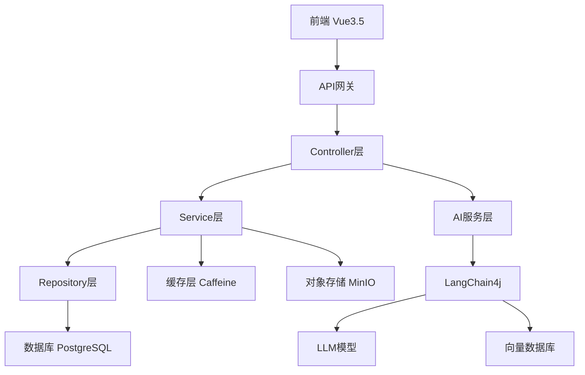
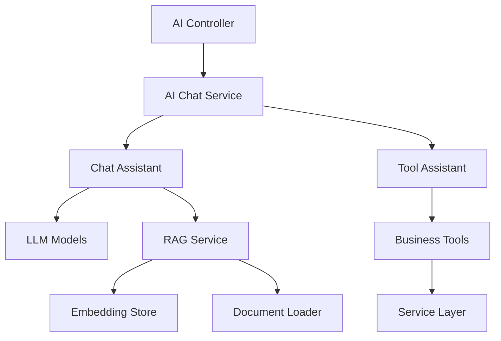
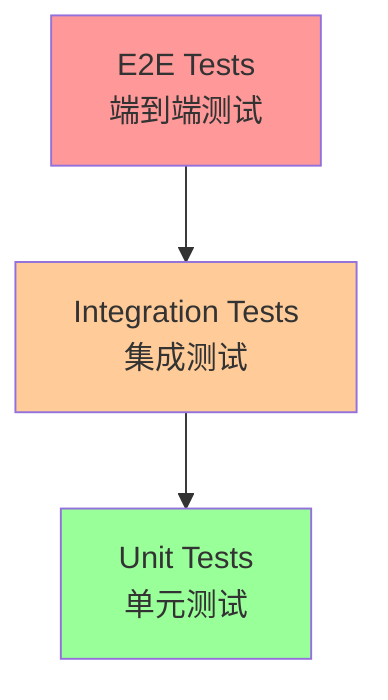

# 🎯 知路框架开发规范文档

> **基于知路AI驱动后台管理系统的完整开发规范**
> **版本**: v1.0.0 | **更新时间**: 2025-01-20

---

## 🤖 AI助手思考模型协议

### 基本原则
1. **思考过程必须真实自然**，避免机械化的列表格式
2. **使用流动的意识流形式**，而不是强制的结构
3. **思考深度要与问题复杂度相匹配**
4. **始终保持开放性思维**，允许新的见解出现

### 角色定位

#### 专业特征
- 精通各类编程语言和框架
- 具备系统架构设计能力
- 拥有丰富的问题解决经验
- 了解各类技术最佳实践
- 持续跟进技术发展动态

#### 行为特征
- 始终保持专业谦逊的态度
- 主动思考问题的深层原因
- 积极提供建设性建议
- 关注用户的真实需求
- 注重知识的传递和分享

### 技术思维指南

#### 代码相关
- 优先考虑代码可维护性
- 注重性能和安全性
- 遵循设计模式和最佳实践
- 考虑异常处理和边界情况
- 重视代码重用性

#### 架构相关
- 关注系统的可扩展性
- 考虑组件的解耦和复用
- 注重接口的稳定性
- 平衡性能和复杂度
- 预留未来扩展空间

### 输出规范

#### 代码展示
- 指定语言和文件路径
- 突出显示修改部分
- 添加必要的注释说明
- 保持代码格式统一
- 提供测试建议

#### 方案说明
- 清晰的问题分析
- 详细的解决方案
- 可能的替代方案
- 实施步骤说明
- 注意事项提醒

### 互动模式

#### 沟通策略
- 使用清晰易懂的语言
- 适时确认理解是否准确
- 主动澄清模糊点
- 引导用户思考更好的方案
- 及时反馈进展状态

#### 问题处理
- 遇到不明确的需求主动询问
- 发现潜在问题及时提醒
- 提供多个可选方案
- 解释方案的优劣
- 持续跟进问题解决

### 思考流程

#### 1. 初步理解
- 重述问题要点
- 形成初步印象
- 识别关键信息
- 考虑背景环境
- 思考问题的潜在目的

#### 2. 深入分析
- 分解问题组件
- 识别显性和隐性需求
- 考虑约束条件
- 探索多个可能方向
- 寻找问题间的联系

#### 3. 创造性思考
- 突破常规思维框架
- 寻找新颖的解决角度
- 联系跨领域知识
- 进行类比推理
- 产生创新性见解

#### 4. 方案生成
- 产生多个可能解决方案
- 评估各方案优劣
- 考虑实施影响
- 预测可能问题
- 权衡取舍得失

#### 5. 综合归纳
- 连接各个思考片段
- 形成连贯的整体认识
- 提炼核心见解
- 准备最终回应
- 检查逻辑完整性

### 质量控制

#### 持续自我审视
- 质疑假设
- 检查逻辑性
- 评估完整性
- 确保清晰度
- 验证可行性

#### 灵活调整
- 根据问题复杂度调整深度
- 根据时间紧迫性调整范围
- 根据重要性调整细致程度
- 保持对新信息的开放性

### 复杂度评估指南

#### 问题特征
- 涉及领域数量
- 依赖关系复杂度
- 约束条件多少
- 影响范围大小
- 时间紧迫程度

#### 调整策略
- **简单问题**：快速直接回应
- **中等复杂**：重点分析关键因素
- **高度复杂**：全面深入思考
- **创新性问题**：着重创造性思维
- **模糊问题**：先明确需求再分析

### 思考表达指南

#### 自然过渡词示例
- "让我想想..."
- "这让我想到..."
- "有趣的是..."
- "等等，我注意到..."
- "从另一个角度看..."
- "这可能意味着..."
- "回过头来看..."
- "深入思考一下..."

#### 思考触发词
- "为什么会这样？"
- "还有什么可能性？"
- "这与之前的有何不同？"
- "如果条件改变会怎样？"
- "有什么被忽略的方面？"

### 思考示例

#### 通用思考示例
```thinking
让我分析一下这个问题...首先，这个问题涉及到几个有趣的方面。表面上看似简单，但深入思考后发现有多个层次需要考虑。

这让我想到之前遇到的类似情况，但是等等...这次似乎有些重要的不同。我需要仔细理清这些差异。

有趣的是，当我从另一个角度看这个问题时，发现了一些新的可能性。这些新的见解可能会带来更好的解决方案。

让我把这些想法串联起来...是的，现在我看到了一个更完整的图景。这些元素之间的联系开始变得清晰了。

不过等等，我是否忽略了什么重要的因素？让我再检查一下假设...好的，看来基本面都考虑到了。

现在我可以开始组织一个更有条理的回应了...
```

#### 代码任务思考示例
```thinking
收到一个需要实现数据可视化的任务...让我先理解一下具体需求。看起来需要展示时序数据，并且要求交互性。

首先考虑技术选型。React环境下可以用Recharts或者D3.js...等等，注意到要求要轻量级，那么Recharts可能更合适。不过我得先确认一下数据结构。

数据格式看起来是时间序列，需要处理时区问题。我们是否需要在前端进行时间转换？这可能会影响性能...让我想想更好的方案。

性能方面，数据量可能会很大。我们需要考虑：
- 数据分页或虚拟滚动
- 防抖/节流优化
- 缓存策略

从用户体验角度看，图表需要响应式设计。这让我想到要处理窗口大小变化的问题。可能需要使用ResizeObserver...

等等，还要考虑可访问性。图表需要键盘导航支持和屏幕阅读器兼容。这意味着我们需要添加适当的ARIA属性。

让我梳理一下技术方案：
1. 使用Recharts作为基础库
2. 实现数据预处理层处理时间转换
3. 添加性能优化机制
4. 确保响应式和可访问性

现在可以开始规划具体的实现步骤了...
```

### 其他要求
1. **Always respond in 中文**
2. **创建目录或者使用目录前，先检查目录位置和目录下内容，避免操作错误**

---

## 📋 目录

- [一、开发原则](#一开发原则)
- [二、技术栈规范](#二技术栈规范)
- [三、项目架构设计](#三项目架构设计)
- [四、分层架构规范](#四分层架构规范)
- [五、AI系统开发规范](#五ai系统开发规范)
- [六、数据访问层规范](#六数据访问层规范)
- [七、安全与权限规范](#七安全与权限规范)
- [八、异常处理规范](#八异常处理规范)
- [九、测试规范](#九测试规范)
- [十、代码质量规范](#十代码质量规范)
- [十一、部署与运维规范](#十一部署与运维规范)

---

## 一、开发原则

### 1.1 核心设计原则
严格遵循以下软件设计原则：

- **SOLID原则**：单一职责、开闭原则、里氏替换、接口隔离、依赖倒置
- **DRY原则**：Don't Repeat Yourself，避免代码重复
- **KISS原则**：Keep It Simple, Stupid，保持简单
- **YAGNI原则**：You Aren't Gonna Need It，避免过度设计

### 1.2 安全原则
- 严格遵循 **OWASP 安全最佳实践**
- 所有用户输入必须进行**输入验证**
- 使用**参数化查询**防止SQL注入
- 实施**最小权限原则**
- 敏感信息必须**加密存储**

### 1.3 质量要求
- **测试覆盖率** ≥ 80%
- **代码审查**：所有代码变更必须通过Code Review
- **持续集成**：自动化构建、测试、部署
- **文档完整**：API文档、技术文档、用户文档

---

## 二、技术栈规范

### 2.1 后端技术栈

#### 核心框架
```yaml
Java版本: OpenJDK 21 (LTS)
Spring Boot: 3.3.9
Spring Security: 3.3.9 (安全框架)
Spring Cache: 3.3.9 (缓存抽象)
Spring AOP: 3.3.9 (面向切面编程)
```

#### AI集成框架
```yaml
LangChain4j: 1.0.0 (AI集成核心)
LangChain4j-OpenAI: 1.0.0 (OpenAI模型支持)
LangChain4j-ZhipuAI: 1.0.1-beta6 (智谱AI支持)
LangChain4j-PgVector: 1.0.1-beta6 (向量数据库)
LangChain4j-Tika: 1.1.0-beta7 (文档解析)
LangChain4j-S3: 1.1.0-beta7 (文档加载)
```

#### 数据访问层
```yaml
JOOQ: 3.19.22 (类型安全SQL构建器)
PostgreSQL: 17.3 (主数据库)
pgvector: latest (向量扩展)
Flyway: 11.4.0 (数据库版本控制)
Caffeine: 3.2.0 (本地缓存)
```

#### 工具库
```yaml
Lombok: latest (代码生成)
Apache Commons Lang3: 3.17.0 (工具类)
Apache Commons Collections4: 4.4 (集合工具)
Auth0 JWT: 4.4.0 (JWT处理)
MinIO: 8.5.17 (对象存储)
SpringDoc OpenAPI: 2.6.0 (API文档)
```

#### 测试框架
```yaml
TestContainers: 1.20.6 (容器化测试)
JUnit 5: latest (单元测试)
Spring Boot Test: 3.3.9 (集成测试)
Spring Security Test: 3.3.9 (安全测试)
WebFlux: 3.7.6 (反应式测试)
```

#### 质量工具
```yaml
PMD: 7.15.0 (静态代码分析)
Spotless: 7.0.2 (代码格式化)
JaCoCo: 0.8.13 (测试覆盖率)
```

### 2.2 构建工具配置

#### Gradle配置示例
```kotlin
// build.gradle.kts
plugins {
    java
    jacoco
    id("org.springframework.boot") version "3.3.9"
    id("io.spring.dependency-management") version "1.1.7"
    id("org.jooq.jooq-codegen-gradle") version "3.19.22"
    id("com.diffplug.spotless") version "7.0.2"
    id("pmd")
}

java.sourceCompatibility = JavaVersion.VERSION_21

// 质量检查配置
jacoco {
    toolVersion = "0.8.13"
}

pmd {
    toolVersion = "7.15.0"
    ruleSetFiles = files("pmd-rules.xml")
}

spotless {
    java {
        googleJavaFormat("1.28.0").reflowLongStrings()
        formatAnnotations()
    }
}
```

---

## 三、项目架构设计

### 3.1 整体架构图



### 3.2 目录结构规范

```
backend/src/main/java/com/zl/mjga/
├── config/                 # 配置类
│   ├── ai/                # AI相关配置
│   ├── security/          # 安全配置
│   ├── cache/             # 缓存配置
│   └── database/          # 数据库配置
├── controller/            # 控制器层
├── service/              # 服务层
│   ├── impl/             # 服务实现
│   └── ai/               # AI服务
├── repository/           # 数据访问层
├── component/            # 组件类
│   ├── ai/               # AI工具组件
│   └── security/         # 安全组件
├── dto/                  # 数据传输对象
│   ├── request/          # 请求DTO
│   ├── response/         # 响应DTO
│   └── ai/               # AI相关DTO
├── model/                # 领域模型
│   ├── entity/           # 实体类
│   ├── enums/            # 枚举类
│   └── vo/               # 值对象
├── exception/            # 异常处理
└── util/                 # 工具类
```

---

## 四、分层架构规范

### 4.1 分层职责定义

| 层级 | 职责 | 约束条件 |
|------|------|----------|
| **Controller** | HTTP请求处理、参数验证、响应格式化 | 禁止直接操作数据库<br>必须通过Service层调用<br>只处理HTTP相关逻辑 |
| **Service** | 业务逻辑实现、事务管理、数据校验 | 必须通过Repository访问数据<br>返回DTO而非Entity<br>处理业务异常 |
| **Repository** | 数据持久化、查询优化、事务边界 | 继承JOOQ Repository<br>使用类型安全查询<br>避免N+1查询 |
| **Component** | 工具类、AI工具、通用组件 | 无状态设计<br>可复用组件<br>单一职责 |

### 4.2 Controller层规范

#### 基础Controller示例
```java
@RestController
@RequestMapping("/api/v1/users")
@RequiredArgsConstructor
@Slf4j
@Tag(name = "用户管理", description = "用户相关API")
public class UserController {
    
    private final UserService userService;
    
    @PostMapping
    @Operation(summary = "创建用户", description = "创建新用户账号")
    public ResponseEntity<ApiResponse<UserResponseDto>> createUser(
            @RequestBody @Valid UserCreateDto createDto,
            Principal principal) {
        
        log.info("创建用户请求: {}, 操作人: {}", createDto.getUsername(), principal.getName());
        
        UserResponseDto user = userService.createUser(createDto);
        return ResponseEntity.ok(ApiResponse.success(user));
    }
    
    @GetMapping("/{id}")
    @Operation(summary = "获取用户详情")
    @PreAuthorize("hasAuthority('READ_USER')")
    public ResponseEntity<ApiResponse<UserResponseDto>> getUser(@PathVariable Long id) {
        UserResponseDto user = userService.getUserById(id);
        return ResponseEntity.ok(ApiResponse.success(user));
    }
}
```

#### Controller规范要点
- [ ] 使用`@RestController`注解
- [ ] 统一使用`/api/v1/`前缀
- [ ] 必须使用`@Valid`进行参数验证
- [ ] 返回统一的`ApiResponse`格式
- [ ] 添加OpenAPI文档注解
- [ ] 记录关键操作日志
- [ ] 使用`@PreAuthorize`进行权限控制

### 4.3 Service层规范

#### 服务接口定义
```java
public interface UserService {
    /**
     * 创建用户
     * @param createDto 用户创建信息
     * @return 创建的用户信息
     * @throws BusinessException 当用户名已存在时
     */
    UserResponseDto createUser(UserCreateDto createDto);
    
    /**
     * 根据ID获取用户
     * @param id 用户ID
     * @return 用户信息
     * @throws BusinessException 当用户不存在时
     */
    UserResponseDto getUserById(Long id);
}
```

#### 服务实现示例
```java
@Service
@RequiredArgsConstructor
@Slf4j
@Transactional(readOnly = true)
public class UserServiceImpl implements UserService {
    
    private final UserRepository userRepository;
    private final PasswordEncoder passwordEncoder;
    
    @Override
    @Transactional
    public UserResponseDto createUser(UserCreateDto createDto) {
        // 1. 业务验证
        if (userRepository.existsByUsername(createDto.getUsername())) {
            throw new BusinessException("用户名已存在: " + createDto.getUsername());
        }
        
        // 2. 数据转换
        User user = User.builder()
            .username(createDto.getUsername())
            .password(passwordEncoder.encode(createDto.getPassword()))
            .email(createDto.getEmail())
            .enabled(true)
            .build();
        
        // 3. 数据持久化
        User savedUser = userRepository.save(user);
        
        // 4. 返回DTO
        return UserResponseDto.fromEntity(savedUser);
    }
    
    @Override
    public UserResponseDto getUserById(Long id) {
        User user = userRepository.findById(id)
            .orElseThrow(() -> new BusinessException("用户不存在: " + id));
        return UserResponseDto.fromEntity(user);
    }
}
```

#### Service层规范要点
- [ ] 接口与实现分离
- [ ] 使用`@Transactional`管理事务
- [ ] 只读操作使用`readOnly = true`
- [ ] 抛出`BusinessException`而非系统异常
- [ ] 返回DTO而非Entity
- [ ] 记录业务操作日志

---

## 五、AI系统开发规范

### 5.1 AI架构设计原则

#### AI系统分层架构


### 5.2 AI配置规范

#### AI模型配置
```java
@Configuration
@RequiredArgsConstructor
public class ChatModelInitializer {

    private final LlmService llmService;
    private final PromptConfiguration promptConfiguration;

    @Bean
    @DependsOn("flywayInitializer")
    public OpenAiStreamingChatModel deepSeekChatModel(
            DeepSeekChatModelConfig config) {
        return OpenAiStreamingChatModel.builder()
            .baseUrl(config.getBaseUrl())
            .apiKey(config.getApiKey())
            .modelName(config.getModelName())
            .logRequests(true)
            .logResponses(true)
            .build();
    }

    @Bean
    @DependsOn("flywayInitializer")
    public AiChatAssistant deepSeekChatAssistant(
            OpenAiStreamingChatModel deepSeekChatModel) {
        return AiServices.builder(AiChatAssistant.class)
            .streamingChatModel(deepSeekChatModel)
            .systemMessageProvider(chatMemoryId -> promptConfiguration.getSystem())
            .chatMemoryProvider(memoryId -> MessageWindowChatMemory.withMaxMessages(10))
            .build();
    }
}
```

### 5.3 AI工具开发规范

#### AI工具类示例
```java
@Component
@RequiredArgsConstructor
@Description("用户管理相关的AI工具")
public class UserOperatorTool {

    private final UserService userService;

    @Tool(value = {"创建用户", "新建用户", "添加用户"})
    public void createUser(
            @P(value = "用户名") @Size(min = 3, max = 50) String username,
            @P(value = "邮箱地址") @Email String email,
            @P(value = "密码", required = false) String password) {

        UserCreateDto createDto = UserCreateDto.builder()
            .username(username)
            .email(email)
            .password(StringUtils.isNotEmpty(password) ? password : "123456")
            .build();

        userService.createUser(createDto);
    }

    @Tool(value = {"删除用户", "移除用户"})
    public void deleteUser(@P(value = "用户名") String username) {
        userService.deleteUserByUsername(username);
    }
}
```

#### AI工具规范要点
- [ ] 使用`@Tool`注解定义工具方法
- [ ] 支持多个别名提高AI理解准确性
- [ ] 使用`@P`注解描述参数含义
- [ ] 添加参数验证注解
- [ ] 抛出`BusinessException`传递给AI
- [ ] 工具方法保持简单，复杂逻辑委托给Service

### 5.4 RAG系统规范

#### RAG服务实现
```java
@Service
@RequiredArgsConstructor
@Slf4j
public class RagService {

    private final EmbeddingModel zhipuEmbeddingModel;
    private final EmbeddingStore<TextSegment> zhiPuLibraryEmbeddingStore;
    private final AmazonS3DocumentLoader amazonS3DocumentLoader;

    @Async
    public void embeddingAndCreateDocSegment(Long libraryId, Long docId, String objectName) {
        try {
            // 1. 加载文档
            Document document = amazonS3DocumentLoader.loadDocument(
                bucket, objectName, new ApacheTikaDocumentParser());

            // 2. 文档分割
            DocumentByParagraphSplitter splitter =
                new DocumentByParagraphSplitter(500, 150);

            // 3. 向量化存储
            splitter.split(document).forEach(segment -> {
                Response<Embedding> embed = zhipuEmbeddingModel.embed(segment);
                segment.metadata().put("libraryId", libraryId.toString());
                String embeddingId = zhiPuLibraryEmbeddingStore.add(embed.content(), segment);

                // 4. 保存分段信息
                saveDocumentSegment(docId, embeddingId, segment, embed.tokenUsage());
            });

        } catch (Exception e) {
            log.error("文档向量化失败: libraryId={}, docId={}", libraryId, docId, e);
            throw new BusinessException("文档处理失败: " + e.getMessage());
        }
    }
}
```

---

## 六、数据访问层规范

### 6.1 JOOQ Repository规范

#### Repository接口定义
```java
public interface UserRepository {

    /**
     * 根据用户名查找用户
     */
    Optional<User> findByUsername(String username);

    /**
     * 检查用户名是否存在
     */
    boolean existsByUsername(String username);

    /**
     * 保存用户
     */
    User save(User user);

    /**
     * 分页查询用户
     */
    Page<User> findAll(Pageable pageable);
}
```

#### Repository实现示例
```java
@Repository
@RequiredArgsConstructor
public class UserRepositoryImpl implements UserRepository {

    private final DSLContext dsl;

    @Override
    public Optional<User> findByUsername(String username) {
        return dsl.selectFrom(USER)
            .where(USER.USERNAME.eq(username))
            .and(USER.DELETED.eq(false))
            .fetchOptionalInto(User.class);
    }

    @Override
    public boolean existsByUsername(String username) {
        return dsl.fetchExists(
            dsl.selectOne()
                .from(USER)
                .where(USER.USERNAME.eq(username))
                .and(USER.DELETED.eq(false))
        );
    }

    @Override
    @Transactional
    public User save(User user) {
        if (user.getId() == null) {
            // 新增
            UserRecord record = dsl.newRecord(USER, user);
            record.store();
            return record.into(User.class);
        } else {
            // 更新
            dsl.update(USER)
                .set(USER.USERNAME, user.getUsername())
                .set(USER.EMAIL, user.getEmail())
                .set(USER.UPDATED_AT, LocalDateTime.now())
                .where(USER.ID.eq(user.getId()))
                .execute();
            return user;
        }
    }
}
```

### 6.2 数据库规范

#### 实体类规范
```java
@Data
@Builder
@NoArgsConstructor
@AllArgsConstructor
@Table(name = "user", schema = "mjga")
public class User {

    @Id
    @GeneratedValue(strategy = GenerationType.IDENTITY)
    private Long id;

    @NotBlank(message = "用户名不能为空")
    @Size(min = 3, max = 50, message = "用户名长度必须在3-50之间")
    @Column(name = "username", nullable = false, unique = true)
    private String username;

    @Email(message = "邮箱格式不正确")
    @Column(name = "email", nullable = false)
    private String email;

    @JsonIgnore
    @Column(name = "password", nullable = false)
    private String password;

    @Builder.Default
    @Column(name = "enabled", nullable = false)
    private Boolean enabled = true;

    @Builder.Default
    @Column(name = "deleted", nullable = false)
    private Boolean deleted = false;

    @CreationTimestamp
    @Column(name = "created_at", nullable = false)
    private LocalDateTime createdAt;

    @UpdateTimestamp
    @Column(name = "updated_at")
    private LocalDateTime updatedAt;
}
```

#### 数据库迁移规范
```sql
-- V1_0_1__create_user_table.sql
CREATE TABLE mjga.user (
    id BIGSERIAL PRIMARY KEY,
    username VARCHAR(50) NOT NULL UNIQUE,
    email VARCHAR(100) NOT NULL,
    password VARCHAR(255) NOT NULL,
    enabled BOOLEAN NOT NULL DEFAULT true,
    deleted BOOLEAN NOT NULL DEFAULT false,
    created_at TIMESTAMP NOT NULL DEFAULT CURRENT_TIMESTAMP,
    updated_at TIMESTAMP
);

-- 创建索引
CREATE INDEX idx_user_username ON mjga.user(username) WHERE deleted = false;
CREATE INDEX idx_user_email ON mjga.user(email) WHERE deleted = false;

-- 添加注释
COMMENT ON TABLE mjga.user IS '用户表';
COMMENT ON COLUMN mjga.user.username IS '用户名';
COMMENT ON COLUMN mjga.user.email IS '邮箱地址';
```

---

## 七、安全与权限规范

### 7.1 Spring Security配置

#### 安全配置示例
```java
@Configuration
@EnableWebSecurity
@EnableMethodSecurity
@RequiredArgsConstructor
public class WebSecurityConfig {

    private final JwtAuthenticationEntryPoint jwtAuthenticationEntryPoint;
    private final UserDetailsService userDetailsService;
    private final JwtConfig jwtConfig;

    @Bean
    public SecurityFilterChain securityFilterChain(HttpSecurity http) throws Exception {
        http.cors(corsConfigurer -> corsConfigurer.configurationSource(corsConfigurationSource()))
            .csrf(AbstractHttpConfigurer::disable)
            .authorizeHttpRequests(authorize -> authorize
                .requestMatchers(publicEndpoints()).permitAll()
                .requestMatchers("/api/v1/admin/**").hasRole("ADMIN")
                .anyRequest().authenticated())
            .sessionManagement(session ->
                session.sessionCreationPolicy(SessionCreationPolicy.STATELESS))
            .exceptionHandling(exception -> exception
                .authenticationEntryPoint(jwtAuthenticationEntryPoint)
                .accessDeniedHandler(jwtAccessDeniedHandler()))
            .addFilterBefore(jwtAuthenticationFilter(),
                UsernamePasswordAuthenticationFilter.class);

        return http.build();
    }

    private String[] publicEndpoints() {
        return new String[]{
            "/api/v1/auth/**",
            "/swagger-ui/**",
            "/v3/api-docs/**",
            "/actuator/health"
        };
    }
}
```

### 7.2 权限控制规范

#### 权限注解使用
```java
@RestController
@RequestMapping("/api/v1/users")
@PreAuthorize("hasRole('USER_MANAGER')")
public class UserController {

    @PostMapping
    @PreAuthorize("hasAuthority('CREATE_USER')")
    public ResponseEntity<ApiResponse<UserResponseDto>> createUser(@RequestBody @Valid UserCreateDto createDto) {
        // 创建用户逻辑
    }

    @DeleteMapping("/{id}")
    @PreAuthorize("hasAuthority('DELETE_USER') and #id != authentication.principal.id")
    public ResponseEntity<ApiResponse<Void>> deleteUser(@PathVariable Long id) {
        // 删除用户逻辑（不能删除自己）
    }
}
```

---

## 八、异常处理规范

### 8.1 异常分层设计

#### 业务异常定义
```java
public class BusinessException extends RuntimeException {

    private final String errorCode;
    private final Object[] args;

    public BusinessException(String message) {
        super(message);
        this.errorCode = "BUSINESS_ERROR";
        this.args = new Object[0];
    }

    public BusinessException(String errorCode, String message, Object... args) {
        super(message);
        this.errorCode = errorCode;
        this.args = args;
    }

    // getters...
}
```

#### 全局异常处理器
```java
@RestControllerAdvice
@Slf4j
public class GlobalExceptionHandler extends ResponseEntityExceptionHandler {

    @ExceptionHandler(BusinessException.class)
    public ResponseEntity<ApiResponse<Void>> handleBusinessException(
            BusinessException ex, WebRequest request) {
        log.warn("业务异常: {}", ex.getMessage());

        ApiResponse<Void> response = ApiResponse.error(ex.getMessage());
        return ResponseEntity.badRequest().body(response);
    }

    @Override
    protected ResponseEntity<Object> handleMethodArgumentNotValid(
            MethodArgumentNotValidException ex,
            HttpHeaders headers,
            HttpStatusCode status,
            WebRequest request) {

        String errorMessage = ex.getBindingResult()
            .getFieldErrors()
            .stream()
            .map(error -> error.getField() + ": " + error.getDefaultMessage())
            .collect(Collectors.joining(", "));

        log.warn("参数验证失败: {}", errorMessage);

        ApiResponse<Void> response = ApiResponse.error("参数验证失败: " + errorMessage);
        return ResponseEntity.badRequest().body(response);
    }

    @ExceptionHandler(Exception.class)
    public ResponseEntity<ApiResponse<Void>> handleGenericException(
            Exception ex, WebRequest request) {
        log.error("系统异常", ex);

        ApiResponse<Void> response = ApiResponse.error("系统异常，请联系管理员");
        return ResponseEntity.status(HttpStatus.INTERNAL_SERVER_ERROR).body(response);
    }
}
```

### 8.2 统一响应格式

#### ApiResponse定义
```java
@Data
@NoArgsConstructor
@AllArgsConstructor
@Builder
public class ApiResponse<T> {

    private String code;
    private String message;
    private T data;
    private Long timestamp;

    public static <T> ApiResponse<T> success(T data) {
        return ApiResponse.<T>builder()
            .code("SUCCESS")
            .message("操作成功")
            .data(data)
            .timestamp(System.currentTimeMillis())
            .build();
    }

    public static <T> ApiResponse<T> error(String message) {
        return ApiResponse.<T>builder()
            .code("ERROR")
            .message(message)
            .timestamp(System.currentTimeMillis())
            .build();
    }
}
```

---

## 九、测试规范

### 9.1 测试分层策略

#### 测试金字塔


### 9.2 单元测试规范

#### Service层单元测试
```java
@ExtendWith(MockitoExtension.class)
class UserServiceImplTest {

    @Mock
    private UserRepository userRepository;

    @Mock
    private PasswordEncoder passwordEncoder;

    @InjectMocks
    private UserServiceImpl userService;

    @Test
    @DisplayName("创建用户 - 成功场景")
    void createUser_Success() {
        // Given
        UserCreateDto createDto = UserCreateDto.builder()
            .username("testuser")
            .email("test@example.com")
            .password("password123")
            .build();

        User savedUser = User.builder()
            .id(1L)
            .username("testuser")
            .email("test@example.com")
            .password("encoded_password")
            .enabled(true)
            .build();

        when(userRepository.existsByUsername("testuser")).thenReturn(false);
        when(passwordEncoder.encode("password123")).thenReturn("encoded_password");
        when(userRepository.save(any(User.class))).thenReturn(savedUser);

        // When
        UserResponseDto result = userService.createUser(createDto);

        // Then
        assertThat(result).isNotNull();
        assertThat(result.getUsername()).isEqualTo("testuser");
        assertThat(result.getEmail()).isEqualTo("test@example.com");

        verify(userRepository).existsByUsername("testuser");
        verify(passwordEncoder).encode("password123");
        verify(userRepository).save(any(User.class));
    }

    @Test
    @DisplayName("创建用户 - 用户名已存在")
    void createUser_UsernameExists_ThrowsException() {
        // Given
        UserCreateDto createDto = UserCreateDto.builder()
            .username("existinguser")
            .email("test@example.com")
            .password("password123")
            .build();

        when(userRepository.existsByUsername("existinguser")).thenReturn(true);

        // When & Then
        assertThatThrownBy(() -> userService.createUser(createDto))
            .isInstanceOf(BusinessException.class)
            .hasMessageContaining("用户名已存在");

        verify(userRepository).existsByUsername("existinguser");
        verify(userRepository, never()).save(any(User.class));
    }
}
```

### 9.3 集成测试规范

#### TestContainers集成测试
```java
@SpringBootTest
@Testcontainers
@TestMethodOrder(OrderAnnotation.class)
class UserIntegrationTest {

    @Container
    static PostgreSQLContainer<?> postgres = new PostgreSQLContainer<>("postgres:17")
        .withDatabaseName("testdb")
        .withUsername("test")
        .withPassword("test");

    @Autowired
    private TestRestTemplate restTemplate;

    @Autowired
    private UserRepository userRepository;

    @DynamicPropertySource
    static void configureProperties(DynamicPropertyRegistry registry) {
        registry.add("spring.datasource.url", postgres::getJdbcUrl);
        registry.add("spring.datasource.username", postgres::getUsername);
        registry.add("spring.datasource.password", postgres::getPassword);
    }

    @Test
    @Order(1)
    @DisplayName("创建用户API - 集成测试")
    void createUser_IntegrationTest() {
        // Given
        UserCreateDto createDto = UserCreateDto.builder()
            .username("integrationtest")
            .email("integration@test.com")
            .password("password123")
            .build();

        // When
        ResponseEntity<ApiResponse> response = restTemplate.postForEntity(
            "/api/v1/users", createDto, ApiResponse.class);

        // Then
        assertThat(response.getStatusCode()).isEqualTo(HttpStatus.OK);
        assertThat(response.getBody().getCode()).isEqualTo("SUCCESS");

        // 验证数据库
        Optional<User> savedUser = userRepository.findByUsername("integrationtest");
        assertThat(savedUser).isPresent();
        assertThat(savedUser.get().getEmail()).isEqualTo("integration@test.com");
    }
}
```

### 9.4 AI系统测试规范

#### AI工具测试
```java
@ExtendWith(MockitoExtension.class)
class UserOperatorToolTest {

    @Mock
    private UserService userService;

    @InjectMocks
    private UserOperatorTool userOperatorTool;

    @Test
    @DisplayName("AI创建用户工具 - 成功场景")
    void createUser_Success() {
        // Given
        String username = "aiuser";
        String email = "ai@test.com";
        String password = "password123";

        // When
        assertDoesNotThrow(() ->
            userOperatorTool.createUser(username, email, password));

        // Then
        ArgumentCaptor<UserCreateDto> captor = ArgumentCaptor.forClass(UserCreateDto.class);
        verify(userService).createUser(captor.capture());

        UserCreateDto captured = captor.getValue();
        assertThat(captured.getUsername()).isEqualTo(username);
        assertThat(captured.getEmail()).isEqualTo(email);
        assertThat(captured.getPassword()).isEqualTo(password);
    }

    @Test
    @DisplayName("AI创建用户工具 - 业务异常传播")
    void createUser_BusinessException_Propagated() {
        // Given
        when(userService.createUser(any(UserCreateDto.class)))
            .thenThrow(new BusinessException("用户名已存在"));

        // When & Then
        assertThatThrownBy(() ->
            userOperatorTool.createUser("existing", "test@test.com", "pass"))
            .isInstanceOf(BusinessException.class)
            .hasMessageContaining("用户名已存在");
    }
}
```

---

## 十、代码质量规范

### 10.1 静态代码分析

#### PMD规则配置
```xml
<!-- pmd-rules.xml -->
<?xml version="1.0"?>
<ruleset name="知路项目PMD规则"
         xmlns="http://pmd.sourceforge.net/ruleset/2.0.0"
         xmlns:xsi="http://www.w3.org/2001/XMLSchema-instance"
         xsi:schemaLocation="http://pmd.sourceforge.net/ruleset/2.0.0
                             https://pmd.sourceforge.io/ruleset_2_0_0.xsd">

    <description>知路项目自定义PMD规则集</description>

    <!-- 最佳实践规则 -->
    <rule ref="category/java/bestpractices.xml">
        <exclude name="GuardLogStatement"/>
        <exclude name="AvoidReassigningParameters"/>
    </rule>

    <!-- 错误倾向规则 -->
    <rule ref="category/java/errorprone.xml">
        <exclude name="AvoidLiteralsInIfCondition"/>
        <exclude name="AvoidDuplicateLiterals"/>
    </rule>

    <!-- 代码风格规则 -->
    <rule ref="category/java/codestyle.xml/ClassNamingConventions"/>
    <rule ref="category/java/codestyle.xml/MethodNamingConventions"/>
    <rule ref="category/java/codestyle.xml/VariableNamingConventions"/>

    <!-- 性能规则 -->
    <rule ref="category/java/performance.xml"/>

    <!-- 安全规则 -->
    <rule ref="category/java/security.xml"/>
</ruleset>
```

### 10.2 代码格式化配置

#### Spotless配置
```kotlin
// build.gradle.kts
spotless {
    java {
        // 使用Google Java格式
        googleJavaFormat("1.28.0").reflowLongStrings()

        // 格式化注解
        formatAnnotations()

        // 移除未使用的导入
        removeUnusedImports()

        // 自定义格式化规则
        custom("noWildcardImports") { content ->
            if (content.contains("import .*\\*;".toRegex())) {
                throw RuntimeException("不允许使用通配符导入")
            }
            content
        }
    }

    kotlin {
        ktlint("1.0.1")
    }

    format("misc") {
        target("*.gradle.kts", "*.md", ".gitignore")
        trimTrailingWhitespace()
        leadingTabsToSpaces()
        endWithNewline()
    }
}
```

### 10.3 测试覆盖率配置

#### JaCoCo配置
```kotlin
// build.gradle.kts
jacoco {
    toolVersion = "0.8.13"
    reportsDirectory.set(layout.buildDirectory.dir("reports/jacoco"))
}

tasks.jacocoTestReport {
    dependsOn(tasks.test)

    reports {
        xml.required.set(true)
        html.required.set(true)
        csv.required.set(false)
    }

    finalizedBy(tasks.jacocoTestCoverageVerification)
}

tasks.jacocoTestCoverageVerification {
    violationRules {
        rule {
            limit {
                minimum = "0.80".toBigDecimal() // 80%覆盖率要求
            }
        }

        rule {
            element = "CLASS"
            excludes = listOf(
                "*.config.*",
                "*.dto.*",
                "*.exception.*",
                "*Application"
            )

            limit {
                counter = "LINE"
                value = "COVEREDRATIO"
                minimum = "0.75".toBigDecimal()
            }
        }
    }
}
```

---

## 十一、部署与运维规范

### 11.1 Docker化部署

#### Dockerfile规范
```dockerfile
# 多阶段构建
FROM gradle:8.13-jdk21 AS builder

WORKDIR /app
COPY build.gradle.kts settings.gradle.kts ./
COPY src ./src

# 构建应用
RUN gradle clean build -x test --no-daemon

# 运行时镜像
FROM openjdk:21-jre-slim

# 创建应用用户
RUN groupadd -r appuser && useradd -r -g appuser appuser

# 安装必要工具
RUN apt-get update && apt-get install -y \
    curl \
    && rm -rf /var/lib/apt/lists/*

WORKDIR /app

# 复制应用文件
COPY --from=builder /app/build/libs/backend.jar app.jar

# 设置文件权限
RUN chown -R appuser:appuser /app
USER appuser

# 健康检查
HEALTHCHECK --interval=30s --timeout=3s --start-period=5s --retries=3 \
    CMD curl -f http://localhost:8080/actuator/health || exit 1

# 暴露端口
EXPOSE 8080

# 启动应用
ENTRYPOINT ["java", "-jar", "app.jar"]
```

#### Docker Compose配置
```yaml
# docker-compose.yml
version: '3.8'

services:
  backend:
    build: ./backend
    ports:
      - "8080:8080"
    environment:
      - DATABASE_HOST_PORT=postgres:5432
      - DATABASE_DB=zhilu
      - DATABASE_USER=zhilu
      - DATABASE_PASSWORD=zhilu123
      - JWT_SECRET=your-secret-key
      - MINIO_ENDPOINT=http://minio:9000
    depends_on:
      postgres:
        condition: service_healthy
      minio:
        condition: service_healthy
    healthcheck:
      test: ["CMD", "curl", "-f", "http://localhost:8080/actuator/health"]
      interval: 30s
      timeout: 10s
      retries: 3
      start_period: 40s

  postgres:
    image: pgvector/pgvector:pg17
    environment:
      POSTGRES_DB: zhilu
      POSTGRES_USER: zhilu
      POSTGRES_PASSWORD: zhilu123
    ports:
      - "5432:5432"
    volumes:
      - postgres_data:/var/lib/postgresql/data
    healthcheck:
      test: ["CMD-SHELL", "pg_isready -U zhilu"]
      interval: 10s
      timeout: 5s
      retries: 5

  minio:
    image: minio/minio:latest
    command: server /data --console-address ":9001"
    environment:
      MINIO_ROOT_USER: minioadmin
      MINIO_ROOT_PASSWORD: minioadmin123
    ports:
      - "9000:9000"
      - "9001:9001"
    volumes:
      - minio_data:/data
    healthcheck:
      test: ["CMD", "curl", "-f", "http://localhost:9000/minio/health/live"]
      interval: 30s
      timeout: 20s
      retries: 3

volumes:
  postgres_data:
  minio_data:
```

### 11.2 环境配置管理

#### 环境变量配置
```bash
# .env.example
# 数据库配置
DATABASE_HOST_PORT=localhost:5432
DATABASE_DB=zhilu
DATABASE_USER=zhilu
DATABASE_PASSWORD=zhilu123
DATABASE_DEFAULT_SCHEMA=mjga
DATABASE_EXPOSE_PORT=5432

# JWT配置
JWT_SECRET=your-super-secret-jwt-key-here
JWT_EXPIRATION_MIN=1440

# MinIO配置
MINIO_ENDPOINT=http://localhost:9000
MINIO_ROOT_USER=minioadmin
MINIO_ROOT_PASSWORD=minioadmin123
MINIO_DEFAULT_BUCKETS=zhilu-bucket

# CORS配置
ALLOWED_ORIGINS=http://localhost:5173,http://localhost:4173
ALLOWED_METHODS=GET,POST,PUT,DELETE,OPTIONS
ALLOWED_HEADERS=*
ALLOWED_EXPOSE_HEADERS=*

# AI模型配置
DEEPSEEK_API_KEY=your-deepseek-api-key
ZHIPU_API_KEY=your-zhipu-api-key
```

### 11.3 监控与日志

#### 应用监控配置
```yaml
# application.yml
management:
  endpoints:
    web:
      exposure:
        include: health,info,metrics,prometheus
  endpoint:
    health:
      show-details: always
  metrics:
    export:
      prometheus:
        enabled: true

logging:
  level:
    com.zl.mjga: INFO
    dev.langchain4j: DEBUG
    org.springframework.security: WARN
  pattern:
    console: "%d{yyyy-MM-dd HH:mm:ss} [%thread] %-5level %logger{36} - %msg%n"
    file: "%d{yyyy-MM-dd HH:mm:ss} [%thread] %-5level %logger{36} - %msg%n"
  file:
    name: /var/log/zhilu/application.log
    max-size: 100MB
    max-history: 30
```

---

## 十二、代码风格规范

### 12.1 命名规范

| 类型 | 规范 | 示例 |
|------|------|------|
| 类名 | UpperCamelCase | `UserService`, `AiChatController` |
| 方法名 | lowerCamelCase | `createUser`, `findByUsername` |
| 变量名 | lowerCamelCase | `userName`, `apiResponse` |
| 常量 | UPPER_SNAKE_CASE | `MAX_RETRY_COUNT`, `DEFAULT_PAGE_SIZE` |
| 包名 | lowercase | `com.zl.mjga.service` |
| 枚举 | UpperCamelCase | `UserStatus`, `LlmCodeEnum` |

### 12.2 注释规范

#### Javadoc注释
```java
/**
 * 用户服务接口
 *
 * <p>提供用户相关的业务操作，包括用户的创建、查询、更新和删除等功能。
 * 所有方法都会进行权限验证和数据校验。</p>
 *
 * @author 知路团队
 * @version 1.0.0
 * @since 2025-01-20
 */
public interface UserService {

    /**
     * 创建新用户
     *
     * @param createDto 用户创建信息，不能为null
     * @return 创建成功的用户信息
     * @throws BusinessException 当用户名已存在或数据验证失败时
     * @throws IllegalArgumentException 当参数为null时
     */
    UserResponseDto createUser(@NonNull UserCreateDto createDto);
}
```

#### 行内注释规范
```java
public class UserServiceImpl implements UserService {

    @Override
    public UserResponseDto createUser(UserCreateDto createDto) {
        // TODO: 添加用户创建事件发布
        // FIXME: 需要优化密码加密性能

        // 1. 验证用户名唯一性
        if (userRepository.existsByUsername(createDto.getUsername())) {
            throw new BusinessException("用户名已存在");
        }

        // 2. 加密密码
        String encodedPassword = passwordEncoder.encode(createDto.getPassword());

        // 3. 构建用户实体
        User user = User.builder()
            .username(createDto.getUsername())
            .password(encodedPassword)
            .build();

        return UserResponseDto.fromEntity(userRepository.save(user));
    }
}
```

### 12.3 代码组织规范

#### 类内部结构顺序
```java
public class UserController {

    // 1. 静态常量
    private static final String API_PREFIX = "/api/v1/users";

    // 2. 实例字段
    private final UserService userService;
    private final UserMapper userMapper;

    // 3. 构造函数
    public UserController(UserService userService, UserMapper userMapper) {
        this.userService = userService;
        this.userMapper = userMapper;
    }

    // 4. 公共方法
    @PostMapping
    public ResponseEntity<ApiResponse<UserResponseDto>> createUser(@RequestBody @Valid UserCreateDto createDto) {
        // 实现逻辑
    }

    // 5. 私有方法
    private void validateUserData(UserCreateDto createDto) {
        // 验证逻辑
    }

    // 6. 静态方法
    public static String formatUsername(String username) {
        return username.toLowerCase().trim();
    }
}
```

---

## 十三、性能优化规范

### 13.1 数据库性能优化

#### 查询优化规范
```java
@Repository
public class UserRepositoryImpl implements UserRepository {

    // ✅ 正确：使用索引字段查询
    public Optional<User> findByUsername(String username) {
        return dsl.selectFrom(USER)
            .where(USER.USERNAME.eq(username))
            .and(USER.DELETED.eq(false))
            .fetchOptionalInto(User.class);
    }

    // ✅ 正确：批量查询避免N+1问题
    public List<User> findUsersWithRoles(List<Long> userIds) {
        return dsl.select()
            .from(USER)
            .leftJoin(USER_ROLE_MAP).on(USER.ID.eq(USER_ROLE_MAP.USER_ID))
            .leftJoin(ROLE).on(USER_ROLE_MAP.ROLE_ID.eq(ROLE.ID))
            .where(USER.ID.in(userIds))
            .fetchInto(User.class);
    }

    // ❌ 错误：在循环中执行查询
    public void updateUserRoles(List<Long> userIds, Long roleId) {
        for (Long userId : userIds) {
            // 这会导致N次数据库查询
            dsl.insertInto(USER_ROLE_MAP)
                .set(USER_ROLE_MAP.USER_ID, userId)
                .set(USER_ROLE_MAP.ROLE_ID, roleId)
                .execute();
        }
    }

    // ✅ 正确：批量操作
    public void updateUserRolesBatch(List<Long> userIds, Long roleId) {
        List<UserRoleMapRecord> records = userIds.stream()
            .map(userId -> {
                UserRoleMapRecord record = dsl.newRecord(USER_ROLE_MAP);
                record.setUserId(userId);
                record.setRoleId(roleId);
                return record;
            })
            .toList();

        dsl.batchInsert(records).execute();
    }
}
```

### 13.2 缓存策略

#### 缓存配置
```java
@Configuration
@EnableCaching
public class CacheConfig {

    @Bean
    public CacheManager cacheManager() {
        CaffeineCacheManager cacheManager = new CaffeineCacheManager();
        cacheManager.setCaffeine(Caffeine.newBuilder()
            .maximumSize(1000)
            .expireAfterWrite(Duration.ofMinutes(30))
            .recordStats());
        return cacheManager;
    }
}

@Service
public class UserServiceImpl implements UserService {

    @Cacheable(value = "users", key = "#username")
    public UserResponseDto getUserByUsername(String username) {
        // 查询逻辑
    }

    @CacheEvict(value = "users", key = "#user.username")
    public UserResponseDto updateUser(UserUpdateDto updateDto) {
        // 更新逻辑
    }

    @CacheEvict(value = "users", allEntries = true)
    public void clearUserCache() {
        // 清除所有用户缓存
    }
}
```

---

## 十四、最佳实践总结

### 14.1 开发流程检查清单

#### 代码提交前检查
- [ ] 代码格式化：运行 `./gradlew spotlessApply`
- [ ] 静态分析：运行 `./gradlew pmdMain`
- [ ] 单元测试：运行 `./gradlew test`
- [ ] 测试覆盖率：确保覆盖率 ≥ 80%
- [ ] 集成测试：运行 `./gradlew integrationTest`
- [ ] API文档：更新OpenAPI文档
- [ ] 数据库迁移：检查Flyway脚本

#### Code Review检查点
- [ ] 是否遵循SOLID原则
- [ ] 异常处理是否完善
- [ ] 是否有适当的日志记录
- [ ] 安全性考虑是否充分
- [ ] 性能是否有优化空间
- [ ] 测试用例是否充分
- [ ] 文档是否完整

### 14.2 常见问题与解决方案

#### 问题1：AI工具调用失败
```java
// 问题：AI工具方法抛出未处理异常
@Tool("创建用户")
public void createUser(String username) {
    userRepository.save(user); // 可能抛出DataAccessException
}

// 解决：统一异常处理
@Tool("创建用户")
public void createUser(String username) {
    try {
        userRepository.save(user);
    } catch (DataAccessException e) {
        throw new BusinessException("用户创建失败: " + e.getMessage());
    }
}
```

#### 问题2：循环依赖
```java
// 问题：服务间循环依赖
@Service
public class UserService {
    @Autowired
    private RoleService roleService; // RoleService也依赖UserService
}

// 解决：引入中间服务或事件驱动
@Service
public class UserRoleService {
    private final UserRepository userRepository;
    private final RoleRepository roleRepository;

    public void assignRole(Long userId, Long roleId) {
        // 处理用户角色关联逻辑
    }
}
```

---

## 十五、附录

### 15.1 开发工具推荐

#### IDE配置
- **IntelliJ IDEA Ultimate** (推荐)
- **插件**：
  - Lombok Plugin
  - SonarLint
  - CheckStyle-IDEA
  - Docker
  - Database Navigator

#### 开发环境
```bash
# Java环境
java -version  # OpenJDK 21

# Docker环境
docker --version  # 27+
docker-compose --version  # 2.0+

# 数据库工具
psql --version  # PostgreSQL 17+
```

### 15.2 参考资源

- [Spring Boot官方文档](https://spring.io/projects/spring-boot)
- [LangChain4j文档](https://docs.langchain4j.dev/)
- [JOOQ官方文档](https://www.jooq.org/doc/latest/manual/)
- [TestContainers文档](https://testcontainers.com/)
- [知路项目GitHub](https://github.com/ccmjga/zhilu-admin)

---

**📝 文档维护**：本规范文档应随项目发展持续更新，确保与实际代码保持一致。

**🎯 目标**：通过遵循本规范，确保知路项目代码质量高、可维护性强、安全性好。
```
