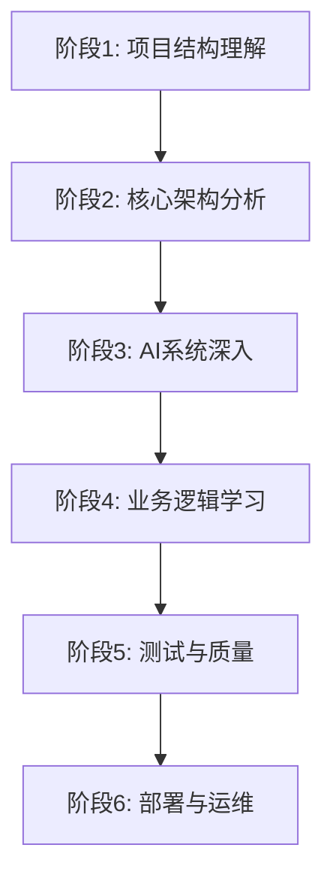
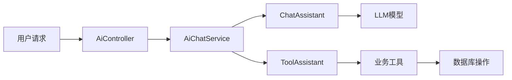

# 🎯 知路框架深度学习路线图

> **学习目标**：全面掌握知路框架的架构设计、AI集成、代码规范和最佳实践

## 📚 学习阶段概览



---

## 🏗️ 阶段1：项目结构理解 (1-2天)

### 1.1 项目整体结构
**目标**：理解项目的整体架构和模块划分

#### 📁 核心目录结构
```
backend/
├── src/main/java/com/zl/mjga/
│   ├── config/          # 配置类
│   ├── controller/      # 控制器层
│   ├── service/         # 服务层
│   ├── repository/      # 数据访问层
│   ├── component/       # 组件类
│   ├── dto/            # 数据传输对象
│   ├── exception/      # 异常处理
│   └── model/          # 模型类
├── src/main/resources/
│   ├── db/migration/   # 数据库迁移
│   └── prompt.txt      # AI提示词
└── build.gradle.kts    # 构建配置
```

#### 🎯 学习重点
- [ ] 查看 `build.gradle.kts` - 了解技术栈和依赖
- [ ] 阅读 `README.md` - 理解项目定位和特色
- [ ] 浏览 `src/main/resources/application.yml` - 配置文件结构

### 1.2 技术栈分析
**重点文件**：[`build.gradle.kts`](backend/build.gradle.kts)

#### 🔍 关键依赖分析
- **Spring Boot 3.3.9** - 现代化Spring框架
- **Java 21** - 最新LTS版本特性
- **LangChain4j** - AI集成核心框架
- **JOOQ** - 类型安全的SQL构建
- **PostgreSQL + pgvector** - 向量数据库支持
- **TestContainers** - 集成测试容器化

---

## 🏛️ 阶段2：核心架构分析 (2-3天)

### 2.1 Spring Boot配置体系
**目标**：理解现代化的配置管理和依赖注入

#### 📋 配置类学习顺序
1. **[`MjgaApplication.java`](backend/src/main/java/com/zl/mjga/MjgaApplication.java)** - 应用启动类
2. **[`SecurityConfig.java`](backend/src/main/java/com/zl/mjga/config/SecurityConfig.java)** - 安全配置
3. **[`DatabaseConfig.java`](backend/src/main/java/com/zl/mjga/config/DatabaseConfig.java)** - 数据库配置
4. **[`CacheConfig.java`](backend/src/main/java/com/zl/mjga/config/CacheConfig.java)** - 缓存配置

#### 🎯 学习重点
- [ ] **依赖注入模式** - 理解`@RequiredArgsConstructor`的使用
- [ ] **配置属性绑定** - `@ConfigurationProperties`的应用
- [ ] **条件化配置** - `@ConditionalOnProperty`等注解
- [ ] **Bean生命周期** - `@PostConstruct`、`@DependsOn`的使用

### 2.2 数据访问层架构
**目标**：掌握JOOQ + Repository模式的现代化数据访问

#### 📊 数据层核心文件
1. **[`DatabaseConfig.java`](backend/src/main/java/com/zl/mjga/config/DatabaseConfig.java)** - 数据源配置
2. **[`UserRepository.java`](backend/src/main/java/com/zl/mjga/repository/UserRepository.java)** - Repository实现
3. **[`IdentityAccessService.java`](backend/src/main/java/com/zl/mjga/service/IdentityAccessService.java)** - 领域服务

#### 🔍 学习要点
- [ ] **JOOQ代码生成** - 类型安全的SQL操作
- [ ] **Repository模式** - 数据访问抽象
- [ ] **事务管理** - `@Transactional`的使用
- [ ] **数据库迁移** - Flyway的版本控制

### 2.3 异常处理体系
**目标**：理解统一异常处理和错误响应机制

#### 🚨 异常处理核心
1. **[`GlobalExceptionHandler.java`](backend/src/main/java/com/zl/mjga/exception/GlobalExceptionHandler.java)** - 全局异常处理
2. **[`BusinessException.java`](backend/src/main/java/com/zl/mjga/exception/BusinessException.java)** - 业务异常定义
3. **[`ErrorResponse.java`](backend/src/main/java/com/zl/mjga/dto/ErrorResponse.java)** - 错误响应格式

#### 📝 学习重点
- [ ] **异常分层** - 系统异常vs业务异常
- [ ] **统一响应格式** - RESTful API设计
- [ ] **国际化支持** - 错误消息的多语言处理

---

## 🤖 阶段3：AI系统深入学习 (4-5天)

### 3.1 AI架构设计理解
**目标**：深入理解AI集成的整体架构

#### 🧠 AI架构核心组件


### 3.2 AI配置与初始化
**学习顺序**：配置 → 初始化 → 服务

#### 🔧 AI配置类深度学习
1. **[`ChatModelInitializer.java`](backend/src/main/java/com/zl/mjga/config/ai/ChatModelInitializer.java)**
   ```java
   // 学习重点：
   // 1. 多模型配置管理
   // 2. Bean依赖关系设计
   // 3. 流式响应配置
   @Bean
   @DependsOn("flywayInitializer")
   public OpenAiStreamingChatModel deepSeekChatModel(DeepSeekChatModelConfig config) {
       return OpenAiStreamingChatModel.builder()
           .baseUrl(config.getBaseUrl())
           .apiKey(config.getApiKey())
           .modelName(config.getModelName())
           .build();
   }
   ```

2. **[`ToolsInitializer.java`](backend/src/main/java/com/zl/mjga/config/ai/ToolsInitializer.java)**
   ```java
   // 学习重点：
   // 1. AI工具注册机制
   // 2. 工具链组装模式
   // 3. 内存管理配置
   @Bean
   public SystemToolAssistant zhiPuToolAssistant(ZhipuAiStreamingChatModel model) {
       return AiServices.builder(SystemToolAssistant.class)
           .streamingChatModel(model)
           .tools(userTool, departmentTool, positionTool)
           .build();
   }
   ```

3. **[`EmbeddingInitializer.java`](backend/src/main/java/com/zl/mjga/config/ai/EmbeddingInitializer.java)**
   - 向量数据库配置
   - 嵌入模型初始化
   - RAG系统搭建

#### 🎯 学习重点
- [ ] **多模型管理** - DeepSeek vs 智谱清言的配置差异
- [ ] **Bean依赖管理** - `@DependsOn`确保初始化顺序
- [ ] **配置模式** - 配置类的设计模式
- [ ] **资源管理** - AI模型的生命周期管理

### 3.3 AI服务层设计
**核心文件**：[`AiChatService.java`](backend/src/main/java/com/zl/mjga/service/AiChatService.java)

#### 🔍 服务层架构分析
```java
@Service
@RequiredArgsConstructor
@Slf4j
public class AiChatService {
    // 学习重点：
    // 1. 多助手管理策略
    // 2. 模型选择算法
    // 3. 会话管理机制
    
    private final AiChatAssistant deepSeekChatAssistant;
    private final AiChatAssistant zhiPuChatAssistant;
    private final SystemToolAssistant zhiPuToolAssistant;
    private final SystemToolAssistant deepSeekToolAssistant;
    
    public TokenStream actionPrecedenceExecuteWith(String sessionId, String message) {
        LlmCodeEnum code = getPrecedenceLlmCode();
        return switch (code) {
            case ZHI_PU -> zhiPuToolAssistant.ask(sessionId, message);
            case DEEP_SEEK -> deepSeekToolAssistant.ask(sessionId, message);
            default -> throw new BusinessException("无效的模型代码");
        };
    }
}
```

#### 📚 深度学习要点
- [ ] **策略模式应用** - 多模型切换策略
- [ ] **会话管理** - 用户会话的生命周期
- [ ] **流式响应** - TokenStream的处理机制
- [ ] **异常处理** - AI调用的错误处理策略

### 3.4 AI工具系统
**目标**：理解AI如何调用业务功能

#### 🛠️ 工具类深度分析
1. **[`UserRolePermissionOperatorTool.java`](backend/src/main/java/com/zl/mjga/component/UserRolePermissionOperatorTool.java)**
   ```java
   @Tool(value = {"创建用户", "入职申请", "开通账号"})
   void createUser(@P(value = "用户名") @Size(min = 1, max = 15) String name) {
       // 学习重点：
       // 1. @Tool注解的多别名支持
       // 2. @P参数注解的验证机制
       // 3. 业务逻辑的封装方式
       User user = userRepository.fetchOneByUsername(name);
       if (user != null) {
           throw new BusinessException("用户已存在");
       }
       identityAccessService.upsertUser(new UserUpsertDto(null, name, name, true, null));
   }
   ```

2. **[`DepartmentOperatorTool.java`](backend/src/main/java/com/zl/mjga/component/DepartmentOperatorTool.java)**
   - 部门层级管理
   - 复杂业务逻辑处理
   - 数据一致性保证

3. **[`PositionOperatorTool.java`](backend/src/main/java/com/zl/mjga/component/PositionOperatorTool.java)**
   - 简单CRUD操作
   - 工具设计模式

#### 🎯 工具系统学习重点
- [ ] **工具注册机制** - `@Tool`注解的工作原理
- [ ] **参数验证** - `@P`注解与Bean Validation集成
- [ ] **异常传播** - 工具异常如何传递给AI
- [ ] **事务管理** - 工具调用的事务边界
- [ ] **权限控制** - 工具调用的安全机制

### 3.5 RAG系统实现
**核心文件**：[`RagService.java`](backend/src/main/java/com/zl/mjga/service/RagService.java)

#### 📖 RAG系统架构
```java
@Service
public class RagService {
    // 学习重点：
    // 1. 文档处理流水线
    // 2. 向量化存储策略
    // 3. 检索增强生成
    
    @Async
    public void embeddingAndCreateDocSegment(Long libraryId, Long docId, String objectName) {
        // 文档加载 → 分割 → 向量化 → 存储
        Document document = amazonS3DocumentLoader.loadDocument(bucket, objectName, parser);
        DocumentByParagraphSplitter splitter = new DocumentByParagraphSplitter(500, 150);
        splitter.split(document).forEach(segment -> {
            Response<Embedding> embed = zhipuEmbeddingModel.embed(segment);
            segment.metadata().put("libraryId", libraryId);
            String embeddingId = zhiPuLibraryEmbeddingStore.add(embed.content(), segment);
            // 保存分段信息
        });
    }
}
```

#### 🔍 RAG学习要点
- [ ] **文档处理流水线** - 加载→分割→向量化→存储
- [ ] **异步处理** - `@Async`的使用和配置
- [ ] **向量存储** - pgvector的集成和使用
- [ ] **检索策略** - 相似度搜索和过滤
- [ ] **元数据管理** - 文档元信息的处理

---

## 💼 阶段4：业务逻辑学习 (3-4天)

### 4.1 领域驱动设计理解
**目标**：理解DDD在项目中的应用

#### 🏗️ 领域模型分析
1. **[`IdentityAccessService.java`](backend/src/main/java/com/zl/mjga/service/IdentityAccessService.java)** - 身份访问领域
2. **[`DepartmentService.java`](backend/src/main/java/com/zl/mjga/service/DepartmentService.java)** - 部门管理领域
3. **[`LlmService.java`](backend/src/main/java/com/zl/mjga/service/LlmService.java)** - AI模型管理领域

#### 📋 DDD学习重点
- [ ] **聚合根设计** - 实体关系的建模
- [ ] **领域服务** - 业务逻辑的封装
- [ ] **值对象** - DTO的设计模式
- [ ] **仓储模式** - Repository的抽象

### 4.2 权限管理系统
**目标**：理解RBAC权限模型的实现

#### 🔐 权限系统核心
```java
// 学习重点：多对多关系的处理
public class IdentityAccessService {
    // 用户-角色-权限的复杂关系管理
    public void bindRoleToUser(Long userId, List<Long> roleIds) {
        // 1. 数据验证
        // 2. 关系绑定
        // 3. 缓存更新
    }
}
```

#### 🎯 权限系统学习要点
- [ ] **RBAC模型** - 角色基础访问控制
- [ ] **多对多关系** - 用户-角色-权限的映射
- [ ] **权限检查** - `@PreAuthorize`的使用
- [ ] **数据权限** - 部门数据隔离

### 4.3 控制器层设计
**核心文件**：[`AiController.java`](backend/src/main/java/com/zl/mjga/controller/AiController.java)

#### 🌐 RESTful API设计
```java
@RestController
@RequestMapping("/ai")
@RequiredArgsConstructor
public class AiController {
    // 学习重点：
    // 1. 流式响应处理
    // 2. 异步请求管理
    // 3. 错误处理机制
    
    @PostMapping(value = "/action/execute", produces = MediaType.TEXT_EVENT_STREAM_VALUE)
    public Flux<String> actionExecute(Principal principal, @RequestBody String userMessage) {
        Sinks.Many<String> sink = Sinks.many().unicast().onBackpressureBuffer();
        TokenStream chat = aiChatService.actionPrecedenceExecuteWith(principal.getName(), userMessage);
        // 流式响应处理
        return sink.asFlux().timeout(Duration.ofSeconds(120));
    }
}
```

#### 📡 控制器学习重点
- [ ] **流式响应** - Server-Sent Events的实现
- [ ] **反应式编程** - Flux和Mono的使用
- [ ] **超时处理** - 长时间请求的管理
- [ ] **安全集成** - Principal的注入和使用

---

## 🧪 阶段5：测试与质量保证 (2-3天)

### 5.1 测试驱动开发理解
**目标**：学习高质量的测试编写

#### 🔬 测试体系分析
1. **单元测试** - `src/test/java/com/zl/mjga/service/`
2. **集成测试** - `src/test/java/com/zl/mjga/integration/`
3. **切片测试** - `@WebMvcTest`, `@DataJpaTest`

#### 📊 测试学习重点
- [ ] **TestContainers** - 容器化集成测试
- [ ] **Mock策略** - `@MockBean`的使用
- [ ] **测试数据管理** - 测试数据的准备和清理
- [ ] **断言技巧** - AssertJ的高级用法

### 5.2 代码质量工具
**目标**：理解代码质量保证机制

#### 🛠️ 质量工具配置
1. **[`pmd-rules.xml`](backend/pmd-rules.xml)** - PMD规则配置
2. **[`build.gradle.kts`](backend/build.gradle.kts)** - Spotless格式化配置
3. **测试覆盖率** - JaCoCo配置

#### 🎯 质量保证学习要点
- [ ] **静态代码分析** - PMD规则的定制
- [ ] **代码格式化** - Spotless的自动化
- [ ] **测试覆盖率** - 覆盖率要求和报告
- [ ] **持续集成** - CI/CD中的质量检查

---

## 🚀 阶段6：部署与运维 (1-2天)

### 6.1 云原生部署
**目标**：理解Docker化部署策略

#### 🐳 容器化配置
1. **[`Dockerfile`](backend/Dockerfile)** - 镜像构建
2. **[`docker-compose.yml`](docker-compose.yml)** - 服务编排
3. **环境配置** - `.env`文件管理

#### 🎯 部署学习重点
- [ ] **多阶段构建** - Docker镜像优化
- [ ] **服务发现** - 容器间通信
- [ ] **数据持久化** - 数据卷管理
- [ ] **健康检查** - 服务监控

---

## 📈 学习进度跟踪

### 每日学习计划
- [ ] **第1天**：项目结构 + 技术栈分析
- [ ] **第2天**：Spring Boot配置体系
- [ ] **第3天**：数据访问层 + 异常处理
- [ ] **第4天**：AI配置与初始化
- [ ] **第5天**：AI服务层设计
- [ ] **第6天**：AI工具系统
- [ ] **第7天**：RAG系统实现
- [ ] **第8天**：业务逻辑 + DDD
- [ ] **第9天**：权限系统 + 控制器
- [ ] **第10天**：测试体系
- [ ] **第11天**：代码质量
- [ ] **第12天**：部署运维

### 学习成果验收
- [ ] 能够独立搭建开发环境
- [ ] 理解AI工具的注册和调用机制
- [ ] 掌握RAG系统的实现原理
- [ ] 能够编写高质量的单元测试
- [ ] 理解项目的部署流程

---

## 🔗 核心类文件快速导航

### AI系统核心类
- [`AiController.java`](backend/src/main/java/com/zl/mjga/controller/AiController.java) - AI接口控制器
- [`AiChatService.java`](backend/src/main/java/com/zl/mjga/service/AiChatService.java) - AI聊天服务
- [`ChatModelInitializer.java`](backend/src/main/java/com/zl/mjga/config/ai/ChatModelInitializer.java) - AI模型初始化
- [`ToolsInitializer.java`](backend/src/main/java/com/zl/mjga/config/ai/ToolsInitializer.java) - AI工具初始化
- [`AiChatAssistant.java`](backend/src/main/java/com/zl/mjga/config/ai/AiChatAssistant.java) - 聊天助手接口
- [`SystemToolAssistant.java`](backend/src/main/java/com/zl/mjga/config/ai/SystemToolAssistant.java) - 工具助手接口

### AI工具类
- [`UserRolePermissionOperatorTool.java`](backend/src/main/java/com/zl/mjga/component/UserRolePermissionOperatorTool.java) - 用户权限工具
- [`DepartmentOperatorTool.java`](backend/src/main/java/com/zl/mjga/component/DepartmentOperatorTool.java) - 部门管理工具
- [`PositionOperatorTool.java`](backend/src/main/java/com/zl/mjga/component/PositionOperatorTool.java) - 岗位管理工具

### RAG系统
- [`RagService.java`](backend/src/main/java/com/zl/mjga/service/RagService.java) - RAG服务实现
- [`EmbeddingInitializer.java`](backend/src/main/java/com/zl/mjga/config/ai/EmbeddingInitializer.java) - 向量模型初始化
- [`LibraryController.java`](backend/src/main/java/com/zl/mjga/controller/LibraryController.java) - 知识库控制器

### 业务核心类
- [`IdentityAccessService.java`](backend/src/main/java/com/zl/mjga/service/IdentityAccessService.java) - 身份访问服务
- [`UserRepository.java`](backend/src/main/java/com/zl/mjga/repository/UserRepository.java) - 用户数据访问
- [`SecurityConfig.java`](backend/src/main/java/com/zl/mjga/config/SecurityConfig.java) - 安全配置

### 配置与异常
- [`GlobalExceptionHandler.java`](backend/src/main/java/com/zl/mjga/exception/GlobalExceptionHandler.java) - 全局异常处理
- [`BusinessException.java`](backend/src/main/java/com/zl/mjga/exception/BusinessException.java) - 业务异常
- [`PromptConfiguration.java`](backend/src/main/java/com/zl/mjga/component/PromptConfiguration.java) - AI提示词配置

---

## 🎯 进阶学习建议

### 扩展学习方向
1. **AI模型集成** - 学习更多LLM模型的接入
2. **性能优化** - 缓存策略和数据库优化
3. **微服务拆分** - 单体到微服务的演进
4. **监控告警** - APM和日志系统集成

### 实践项目建议
1. **添加新的AI工具** - 扩展业务操作能力
2. **集成新的LLM模型** - 如通义千问、文心一言
3. **优化RAG系统** - 提升检索准确性
4. **完善测试覆盖** - 提高代码质量

---

## 📚 参考资源

- [LangChain4j官方文档](https://docs.langchain4j.dev/)
- [Spring AI文档](https://docs.spring.io/spring-ai/reference/)
- [JOOQ官方文档](https://www.jooq.org/doc/latest/manual/)
- [TestContainers文档](https://testcontainers.com/)
- [知路项目GitHub](https://github.com/ccmjga/zhilu-admin)

---

## 💡 学习技巧

### 代码阅读策略
1. **自顶向下** - 从Controller开始，逐层深入
2. **关注注解** - 理解Spring注解的作用和配置
3. **追踪调用链** - 使用IDE的"Go to Declaration"功能
4. **运行调试** - 设置断点，观察程序执行流程
5. **编写测试** - 通过测试验证理解的正确性

### 实践建议
1. **搭建环境** - 先让项目在本地跑起来
2. **修改代码** - 尝试添加简单功能
3. **阅读日志** - 理解程序的执行过程
4. **查看数据库** - 观察数据结构和变化
5. **使用AI助手** - 与系统的AI功能交互

---

**🎉 祝你学习愉快！通过这个系统化的学习路线，你将全面掌握知路框架的精髓！**
